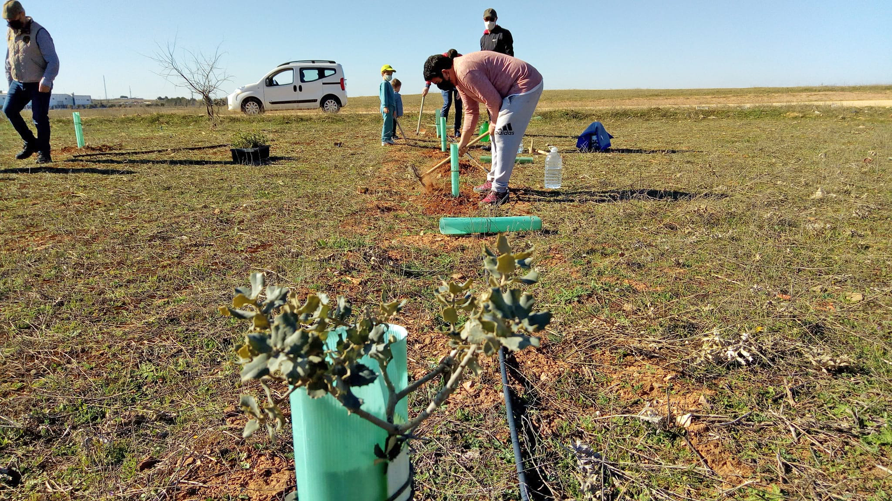

En una mañana transparente y clara de azules cielos y de ilusiones renovadas, la asociación “Encinares Vivos de La Mancha” ha realizado una jornada de plantación de encinas en una parcela municipal de Alcázar de San Juan, al lado de la ermita de San Cristóbal, el domingo 14 de marzo.

Ha sido posible gracias a la colaboración desinteresada de muchas personas que se han acercado a este paraje para plantar pequeños árboles que darán vida a un entorno natural que entre todos vamos a recuperar y cuidar para el futuro.

Queremos dar las gracias a todos ellos por su trabajo y animarles para que sigan colaborando en este hermoso sueño natural en el que estamos todos implicados para hacer posible la recuperación y protección del entorno natural manchego. 

