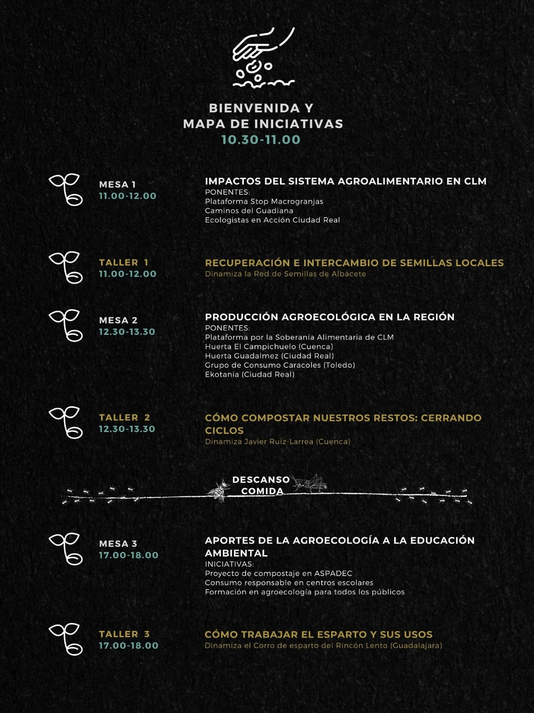

La Junta de Comunidades de Castilla-La Mancha, por medio de Geoalternativa, ha organizado para el próximo **sábado 13 de noviembre** las  JORNADAS REGIONALES “Agroecología, biodiversidad y educación ambiental en Castilla- La Mancha”

Una oportunidad para intercambiar y saber qué está pasando en nuestra región con el sistema agroalimentario: qué impactos, qué propuestas productivas, de consumo y educativas nos ayudan a mejorar nuestro entorno

Si estás interesad@, puedes inscribirte en las actividades que más te interesen (tenemos plazas limitadas por cuestiones sanitarias) a través de este [formulario](https://forms.gle/6FR7r8MjhZVyjoDQ8) o del correo educacion@geoalternativa.org.
 ¡Habrá retransmisiones en directo para quienes no pueden asistir! A través del Instagram de la Asociación GeoAlternativa @geoalternativaesp

## Programa

