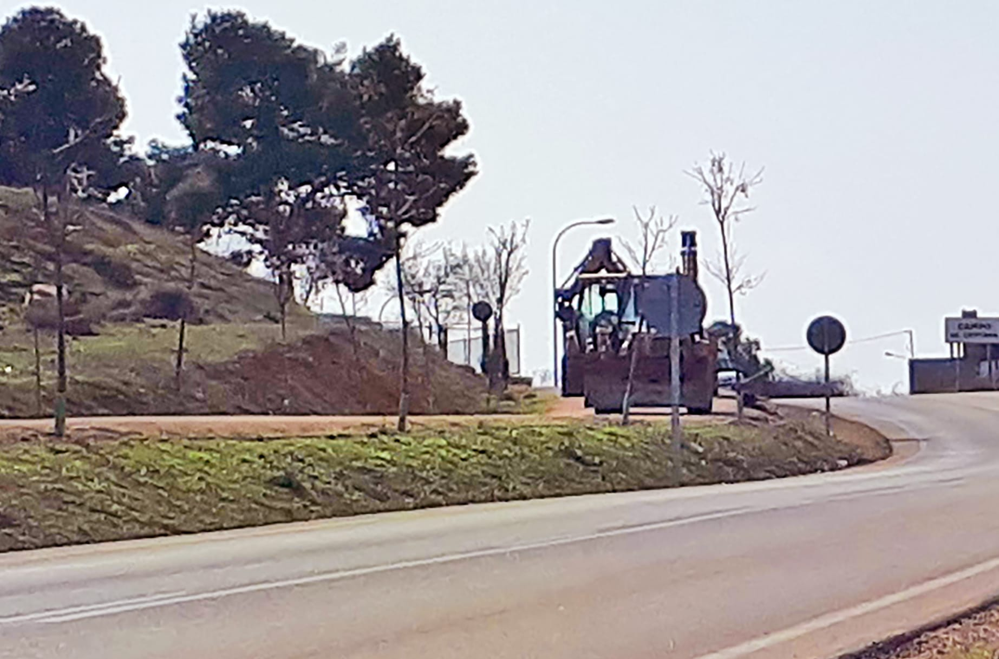

Pese a todos los llamamientos realizados en los últimos meses por parte del colectivo ecologista, en el día de hoy, 24 de febrero de 2021, el ayuntamiento de Campo de Criptana ha procedido a arrancar los árboles plantados hace unos años en el margen izquierdo de la vía verde al Cristo, que discurre paralela a la carretera regional CM-3105. Se ampara para ello en una resolución de la Consejería de Fomento de 27 de noviembre del pasado año por la que dictamina que, de acuerdo al Reglamento de Carreteras regional, no se pueden, con carácter general, realizar plantaciones dentro de los 3 metros próximos a la arista externa de la explanación de la carretera.

Son muchas las razones que, siempre dentro de los límites legales, nos han movido para emplazar al ayuntamiento a buscar una solución, pero durante todo este tiempo, lamentablemente, no hemos encontrado una gestión eficaz ni válida por su parte.

Primero, y de forma sorprendente, dejó pasar el plazo de un mes que le concedía la propia resolución para presentar un recurso. En este sentido, el reglamento de carreteras posibilita excepciones en función de muchas circunstancias. Y esa zona las tiene todas: proximidad al casco urbano, tráfico poco abundante, zona tradicional de paseo y esparcimiento, escaso peligro para el tráfico de los árboles en sí, al estar elevados sobre un talud, territorio paisajísticamente protegido en el que la carretera no es su elemento principal, sino que esta debe adaptarse a él, posibilidad de establecer reducciones de velocidad, que además irían en beneficio del carácter recreativo de la zona, etc. Pero al no presentar dichas alegaciones en el plazo estipulado, el ayuntamiento ha provocado que la resolución ya sea firme e, hipócritamente, ahora actúe de forma súper eficaz y se disponga con toda diligencia a sacar el arbolado porque hay que cumplir la ley.

Segundo, no entendemos esa atropellada diligencia cuando el único plazo del que, por ahora, tenemos noticia, es el que se da en la resolución, en su punto 13, de doce meses.

Tercero, nos duele ver que un ayuntamiento que siempre ha sido tan poco escrupuloso en saltarse su propia normativa urbanística de protección del paisaje en el entorno de la sierra y en este mismo entorno de la Poza (incluso facilitando la ampliación de la propia carretera en este tramo), ahora sea tan escrupuloso en tirar de excavadora contra unos arbolillos que van a beneficiar a todos, sin explorar, aparte de las vías legales, otras opciones; que las hay. El enorme ancho de esta vía, 6 m, frente a los 3,5-4 m del camino de la Virgen, creemos que deja mucho margen para un replanteamiento serio de las plantaciones, incluso respetando las distancias que, con carácter general, marca el reglamento de carreteras. Pero en esto, tampoco el ayuntamiento ha estado diligente ni ha dado muestras de intentarlo.

Con todo lo dicho pudiera parecer que el objetivo era, claramente, eliminar el arbolado sin más miramientos. Y en ello se está ahora. Creemos que, en este contexto, pedir al alcalde que se ponga en cabeza de una movilización popular por la calidad de nuestras vías verdes para todos los vecinos, y en especial de las plantaciones de esta del Cristo, no sabemos si puede tener algún sentido.

Y por ello, Salicor-Ecologistas en Acción quiere, en este momento, exponer a la ciudadanía de Campo de Criptana que no es de recibo que si hace ahora 50 años nuestros padres y abuelos, con muchos menos medios y más dificultades que nosotros, fueron capaces de legarnos con esfuerzo una joya como es el camino de la Virgen, arbolado y sombreado en sus dos márgenes, y disfrutado diariamente por centenares, a veces, miles, de personas, hoy, en pleno siglo XXI, con abundancia de medios de todo tipo, no seamos capaces de actuar con inteligencia y esfuerzo y legar a nuestros hijos y nietos un paseo verde al Cristo, profusamente arbolado en sus dos márgenes, transitable en verano, discurriendo por un paisaje realmente excepcional y con unas connotaciones culturales fuera de toda duda.

No estamos pidiendo un imposible, estamos hablando de dar un servicio de calidad, de futuro, y, a la vez, económicamente poco costoso, a toda una población que no cuenta, por ejemplo, con la alternativa de un gran parque público. Y estamos hablando, también, por qué no, de no marginar a una población como la del norte del casco urbano, porque no se lo merece, y porque está muy necesitada de una infraestructura como esta y de la revalorización de sus barrios, mientras ve cómo todo el sector oriental y sur de la población, por fortuna, sí las tiene, y muy cerca. Y en este último caso, con la construcción del carril peatonal del polígono, sin ser tan escrupulosos con las distancias legales de las plantaciones y del propio camino a la carretera.

