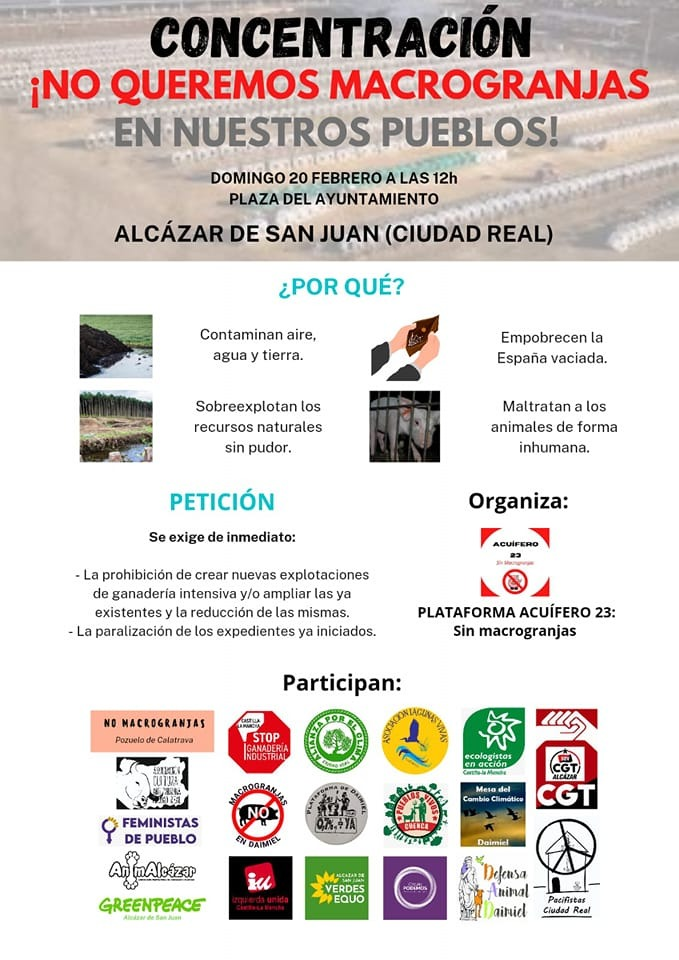

Hay una ganadería tradicional, extensiva, que convive en simbiosis con la naturaleza; siembra sus campos, sus animales se alimentan de esa siembra y ofrece productos que alimentan a la gente.

Y hay una ganadería industrial, intensiva, en macrogranjas, que, en cambio, tiene una relación parasitaria con el entorno y las consecuencias de su instalación en un lugar con sus decenas de miles de cerdos, aves o vacas son realmente terribles para personas y territorios.

Son terribles, en primer lugar, para la ganadería tradicional, que ya no puede subsistir sin grandes dificultades. Los campos se llenan de purines, ese estiércol licuado y pastoso con fuerte olor amoniacal, resultado de la mezcla de las defecaciones, aguas de lavado y restos de piensos. Y el ganado ya no quiere comer ahí. A las ovejas no les gustan las tierras donde hay purines porque es como si a ti te pusieran una mierda en el plato. Y hay que ir a hasta 30 kilómetros de distancia de la macrogranja para encontrar lugares donde alimentarlas.

Y son terribles para la gente que vive en su entorno. Los olores apestosos e insufribles te saludan al amanecer y siguen ahí cuando te acuestas. Un día te cortan el agua y te enteras que la contaminación con nitratos del acuífero hace inviable seguir usando la captación municipal. Y piensas si la agricultura de la zona se verá afectada.

Y más allá de ti y de tu pueblo, te enteras de que este tipo de instalaciones industriales, donde los animales son despojados de todo bienestar y cruelmente tratados como máquinas de hacer dinero, son grandes emisoras de gases de efecto invernadero: solo la ganadería industrial de porcino en España es la responsable del 34% de las emisiones de metano, un gas de efecto invernadero más potente que el CO2.  

Y más. La ingente cantidad de piensos y pastos necesarios para alimentar la producción industrial de carne son uno de los principales factores de deforestación mundial y de cambio de usos del suelo. El 80% de la superficie agrícola mundial ya se destina a producir alimentos para animales y no para consumo humano directo.

La ganadería industrial es la principal y casi única emisora de amoniaco en España y en la UE. En España, el 94% de las emisiones de amoniaco son generadas por la ganadería industrial, 73% por el porcino industrial y 21% por el sector avícola.

Hay un fuerte impacto paisajístico y una destrucción de hábitats. Las macrogranjas implican una ocupación territorial importante. Además de las instalaciones, en España el 66% de la superficie cultivada ya se destina a producir alimentos para animales, no para personas. 

Hay, también, un impacto en nuestra salud. Primero, porque nos va haciendo resistentes a los antibióticos. La ganadería industrial es la principal consumidora de antibióticos en el mundo, y España es el país de Europa donde más se utilizan en este sector. El uso masivo de antibióticos en la ganadería industrial contribuye significativamente a la pérdida de eficiencia de estos medicamentos. Según la OMS, la resistencia a antibióticos podría provocar más muertes que el cáncer en 2050. Pero también, en segundo lugar, impacta en nuestra salud porque el excesivo consumo de carne está asociado al sobrepeso, obesidad, cáncer, diabetes tipo II y enfermedades cardiovasculares. 

Y ahora, para variar, hablemos de pandemias. Las grandes y recientes crisis de seguridad alimentaria en el mundo vienen de la mano de la ganadería industrial: vacas locas, gripe aviar, gripe porcina, salmonella, listeria... Y pandemias como la de la COVID19 están íntimamente relacionadas con la destrucción de los hábitats.
Por otra parte, la agricultura industrial usa enormes cantidades de agua, la valiosa y escasa agua, y gran parte se destina a producir alimentos para animales. En España, se estima que la ganadería utiliza en un año lo equivalente al consumo de todos los hogares en 21 años.

Y todo ello para acabar destruyendo empleos y más concentración en el sector. Una macrogranja genera menos empleo que la ganadería extensiva y ecológica, dado que todo está muy automatizado. Además supone una amenaza para las pequeñas y medianas granjas de la zona. En España, entre 2004 y 2016, se redujo un 27% el número total de explotaciones ganaderas, habiendo desaparecido totalmente las granjas más pequeñas e incrementándose un 96% el número de las más grandes.

Por eso, nadie quiere macrogranjas junto a sus pueblos. Solo benefician a grandes oligopolios sin escrúpulos que las dedican, sobre todo, para exportar a China y otros países esquilmando nuestro medio ambiente y nuestra propia vida.

**El próximo domingo, 20 de febrero, rebélate. Acude a la concentración “¡No queremos macrogranjas en nuestros pueblos!” a las 12:00 en Plaza del Ayuntamiento de Alcázar de San Juan.**

