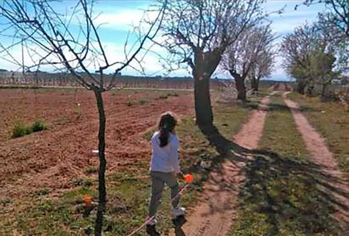
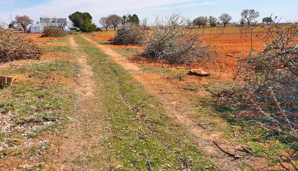

El pasado sábado, 27 de febrero tuvo lugar en el paraje de Carralero, una brutal tala de 9 almendros en flor y un cerezo que llevaban plantados desde 1.946 para delimitar las dos márgenes del entradero que llega a la Casa de Perreta desde el camino del Batán. Dicho entradero atraviesa una parcela de pistachos, cuyo dueño actual, según se nos informa, parece haber sido el que ha ordenado la tala.

No es la primera barbarie cometida contra nuestro patrimonio de arbolado local. Desde Salicor-Ecologistas en Acción venimos asistiendo desde hace años en nuestro término municipal a episodios de muerte o tala de encinas (Dehesa de Arenales, encinar relíctico de San Roque…) y tala vandálica de árboles monumentales de toda especie, muchas veces por obtener unos míseros kilos más de pistachos o uvas en el cultivo aledaño o, incluso, por rencillas y venganzas entre vecinos linderos que acaban pagando los inocentes árboles, como en el triste e irracional episodio sucedido hace varios años en el paraje del Puente de San Benito que acabó con tres vigorosas acacias casi centenarias con troncos de un metro de diámetro.

Pero, mientras que en el caso de las encinas siempre hay un resquicio legal para defenderlas debido a su carácter de especie protegida, en el resto de especies, sobre todo las agrícolas, por muy monumentales o antiguas que sean, no es posible su efectiva defensa legal y toda actuación contra ellas queda dolorosamente impune. Sobre todo para las familias y personas afectadas por la desaparición de los árboles, que, como denominador común, siempre relatan que ellos eran parte de su historia y que viviendo todos junto a ellos era como si siempre hubieran vivido junto al abuelo o el tío que los plantó hace decenas de años.

Salicor-Ecologistas en Acción siempre ha propuesto una protección especial en todo nuestro término para este tipo de árboles de especies no protegidas o no catalogados como árboles singulares, pero que por su monumentalidad o edad merecen ser protegidos igualmente. Creemos que esta ha sido la gota que ha colmado el vaso y que, ahora sí, se deberían introducir cambios en la ordenanza local de medio ambiente para evitar que vuelvan a producirse este tipo de actuaciones en contra de nuestro patrimonio natural.

