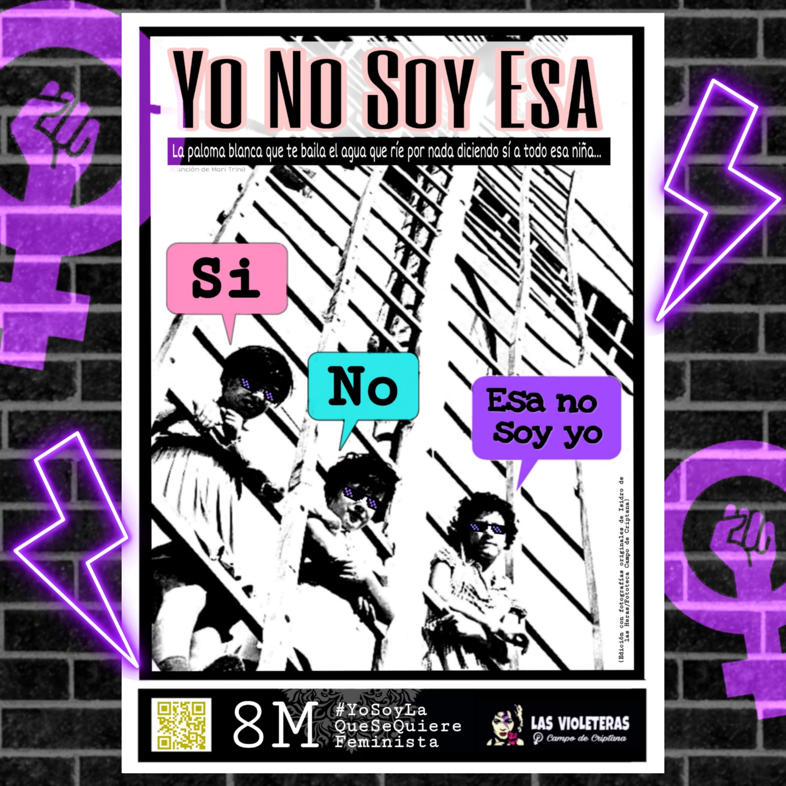
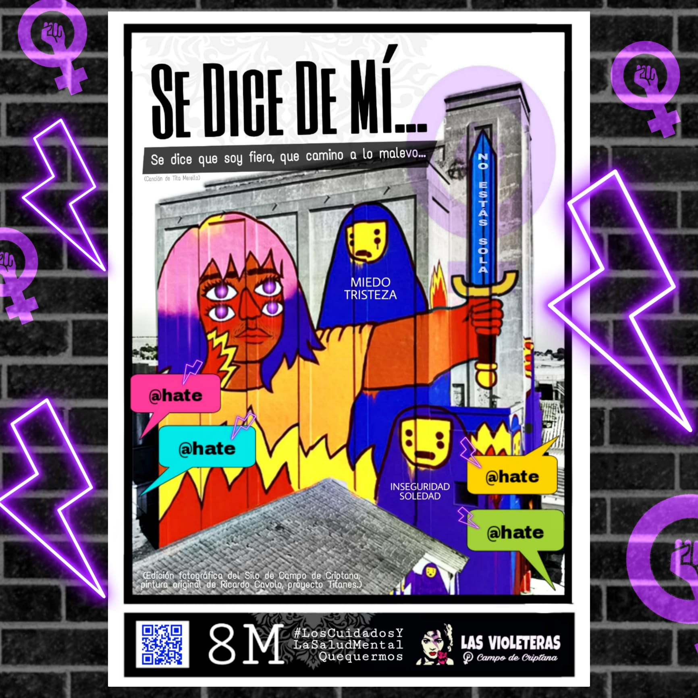
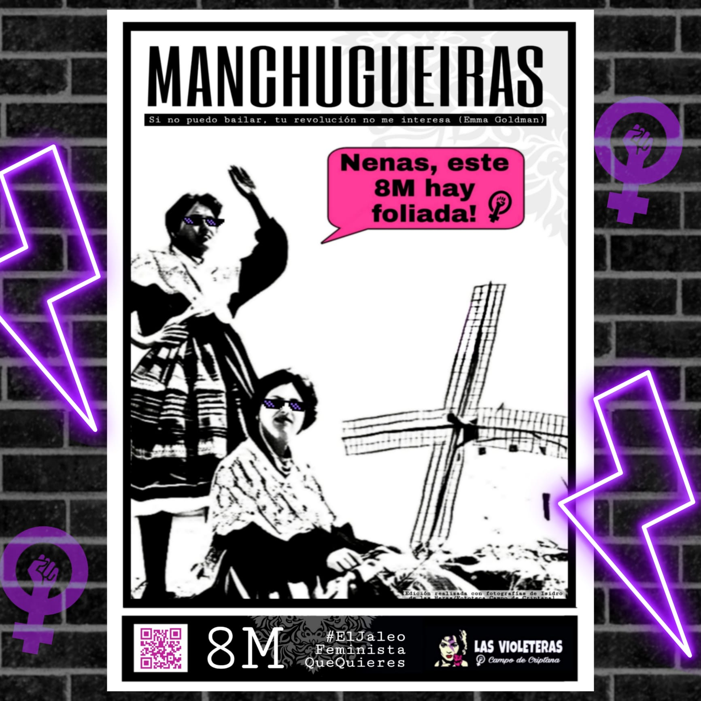
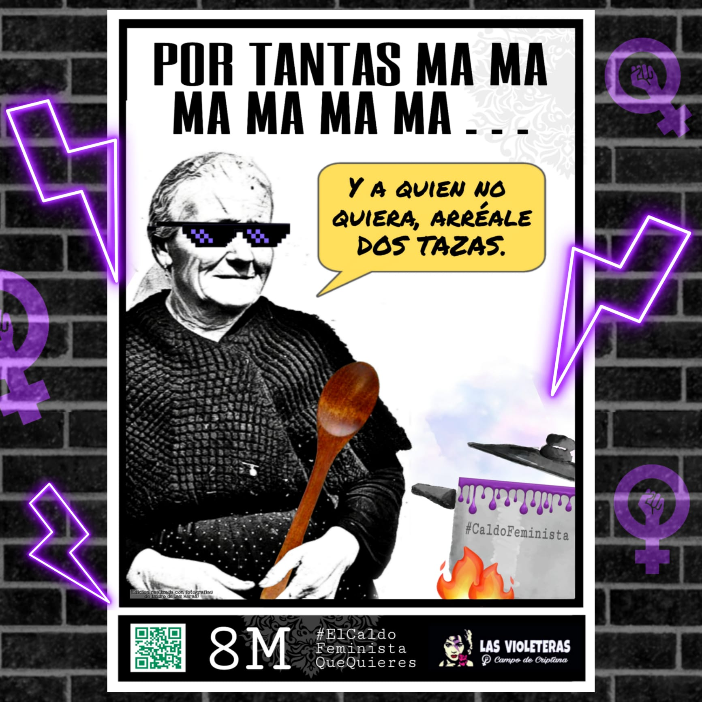

Como cada año, las Violeteras de nuestro pueblo se movilizan este 8 de Marzo para visibilizar y denunciar el sometimiento de las mujeres por el patriarcado, un sometimiento que es aún mayor en el medio rural.

Este año, como [manifiesto](https://maria-sanchez.es/por-un-feminismo-de-hermanas-de-tierra) de la jornada se ha elegido un texto de Lucía López Marco y María Sánchez.

## Por un feminismo de hermanas de tierra

> La primavera se intuye, y hay una semilla que germina y que lucha por crecer. Sola, comienza a abrirse paso, rompiendo la tierra, poco a poco, al ritmo del sol, irá creciendo. Pero para nacer y crecer también necesita el agua. Y si no llega, luchará por encontrarla.
>  
> Hermana,
>
> nosotras,
>
>también somos así. Nos abrimos paso como las semillas. A primera vista parecen invisibles, pero que crecen con la fuerza de nuestras voces en un territorio lleno de vida que no deja de tejer comunidad gracias a nuestras manos y nuestras palabras.
>
> También somos parte de la vida de nuestros pueblos: nana, raíz, latido. Y como esas semillas que se enganchan en la lana de las trashumantes para germinar a miles y miles de kilómetros de su lugar de origen, resistimos y luchamos. Y miramos a las que nos precedieron y sabemos porque no podemos callar más.
> 
> Dicen que el 8 de marzo es de todas.
> 
> Pero lo que se refleja en los medios y en las redes no suele ser así. Porque muchas veces nos quedamos en la superficie y no vamos más allá de las ciudades, y de nombrar y celebrar a mujeres de los círculos estrictamente culturales.
> 
> ¿Dónde quedamos las mujeres rurales? ¿Cómo ? ¿Cómo sacar de la umbría lo que no se conoce? ¿Cómo valorar unas manos que trabajan pero que, a vista de muchos, siguen siendo invisibles?
> 
> Las mujeres rurales, en este sistema capitalista, tecnocrático y urbanocéntrico, hemos sido siempre doblemente marginadas, doblemente olvidadas: por ser mujeres y por ser rurales.
> 
> Mujeres rurales,
> 
> hermanas de un hijo único, mujeres de, hijas de, hermanas de, nietas de, sobrinas de…
> 
> Siempre en la sombra, pero llevando todo el peso. Dueñas de nada, pero encargadas de todo.
> 
> Ya va siendo hora de rendir homenaje al trabajo y al sudor de mujeres como nuestras abuelas y nuestras madres, que tanto trabajaron la tierra y que cargaron con la mochila a la vez de los cuidados domésticos a la sombra, en el más absoluto silencio.
> 
> Hay que nombrarlas una a una.
> 
> Servir de altavoz para que sus voces retumben.
> 
> Contar que también fueron: que son y serán mujeres fuertes de tierra que la mayoría de las veces no pudieron elegir ni decidir. Que a base de renuncias, creciendo en una casa construida sobre cimientos de desigualdad y machismo, nos abrieron vereda a las demás.
> 
> Y no:
> 
> no nos olvidamos tampoco de aquellas que hoy, aunque quisieran, no pueden hacer huelga ni venir a la manifestación.
> 
> Porque seguimos siendo nosotras las que cuidamos: de las personas, de los rebaños, de los cultivos, de los campos, los bosques y de los pueblos. Y — cómo no — no podemos olvidar a todas esas compañeras migrantes que trabajan en situaciones precarias llenas de abusos y machismo en nuestro territorio. Ellas, mujeres, rurales y migrantes, triplemente marginadas.
> 
> Insistimos.
> 
> Ya es hora de cambiar la forma de mirar.
> 
> Siempre estuvimos aquí. Trabajando la tierra, cuidando, siendo la raíz invisible pero esencial que hacía que el hogar siguiera en pie.
> 
> A pesar de lo difícil que lo tuvieron las que nos precedieron y de lo difícil que sigue siendo ahora.
> 
> No, no necesitamos que nadie nos salve.
> 
> Queremos espacios y altavoces: Estamos aquí, estuvimos: queremos seguir estando.
> 
> Queremos que la Administración no piense solo en satisfacer las demandas de las ciudades, porque nosotras también necesitamos servicios básicos. Queremos poder decidir si irnos o quedarnos. Queremos dejar de ser ciudadanas de segunda. Queremos soberanía alimentaria, ganadería extensiva y agroecología. Queremos crear comunidades, mantenerlas, ayudarnos siempre las unas a las otras. Sentirnos reconocidas y respaldadas.
> 
> Y queremos ser un ejemplo para las niñas del futuro, sean o no nuestras hijas o nuestras nietas. Queremos decirles que esta también es su tierra. Que esta cultura llena de animales, árboles, territorios y personas también es de ellas. Que de aquí venimos y es hacia dónde vamos. Porque no nos queremos ir. Porque creemos que otras formas de vida, de relación y de producción son posibles, más allá de este sistema explotador, y que nuestros márgenes tienen mucho que enseñar y que nutrir.
> 
> auzolan en euskera,
> 
> a vecinal en aragonés,
> 
> facendera en leonés,
> 
> sestaferia en asturiano,
> 
> roga en gallego,
> 
> a tornallom en valenciano,
> 
> a cumuña en cántabro,
> 
> treball a jova en catalán,
> 
> a vediau en aranés ...
> 
> Trabajos comunales, manos que cuidan y ayudan. Una forma natural de trabajo para realizar muchas labores del campo o del entorno rural, en general, que alimentaban y daban vida a nuestros pueblos.
> 
> Ahora, más que nunca, tenemos que recuperar estas palabras, y — sobre todo — dar vida de verdad a todo lo que estas palabras de nuestro territorio contienen.
> 
> Tenemos que seguir tejiendo redes en el medio rural, contar, hablar, alzar la voz, ayudarnos las unas a las otras. Formar parte de la raíz y de las ramas.
> 
> Porque nuestro territorio no está vacío, por más que os hayáis empeñado en vaciarlo.
> 
> Porque seguimos aquí, porque estamos vivas aquí.
> 
> Por un feminismo de todas,
> 
> por un feminismo de hermanas de tierra.

