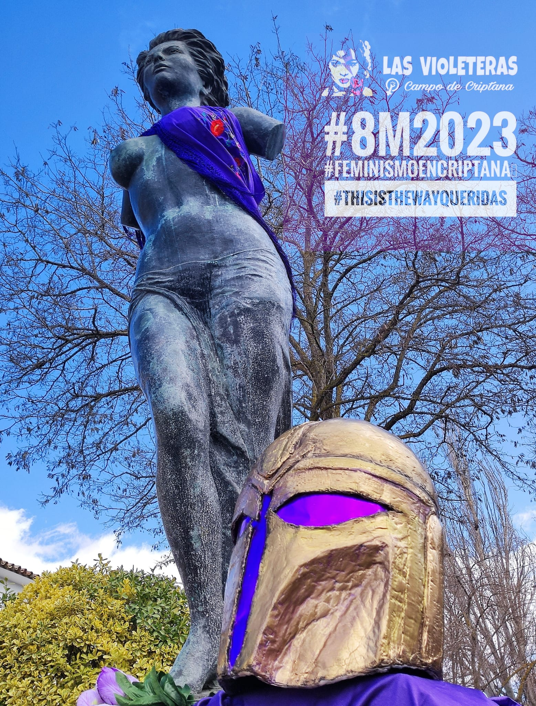
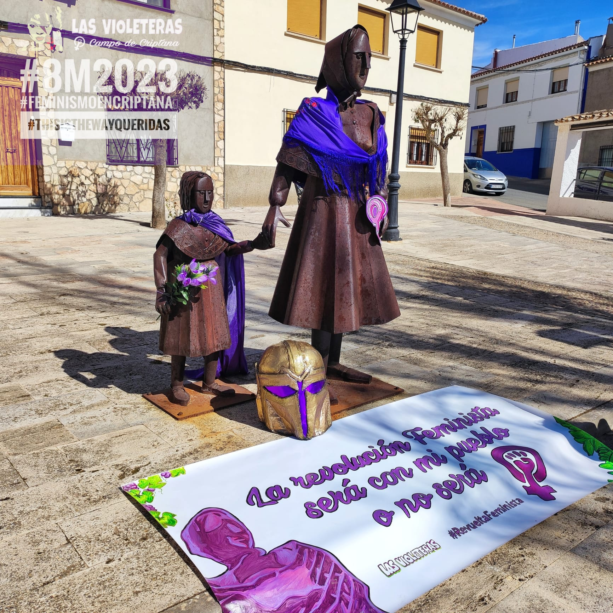
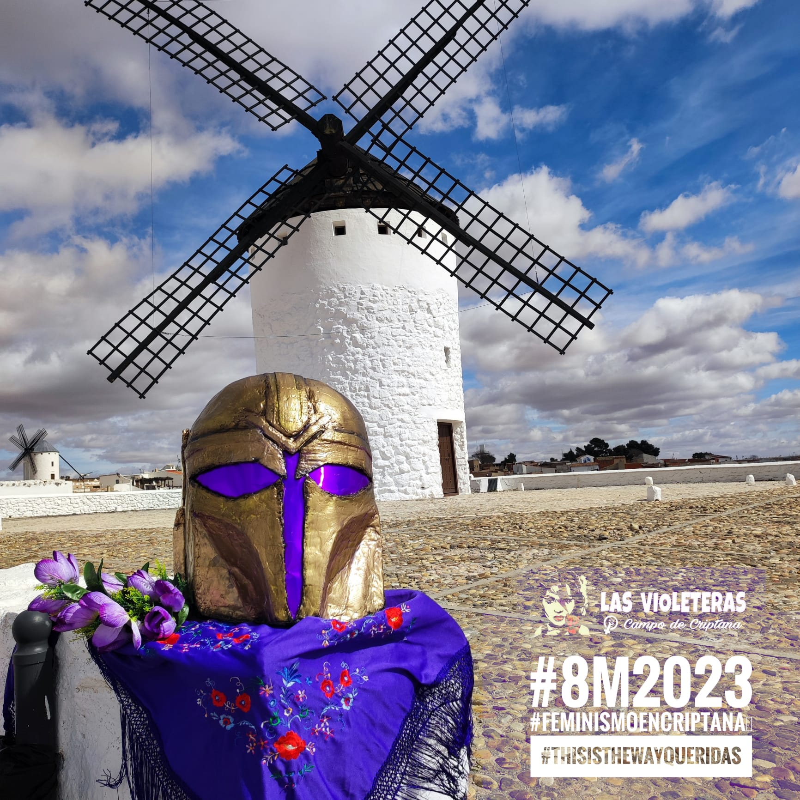
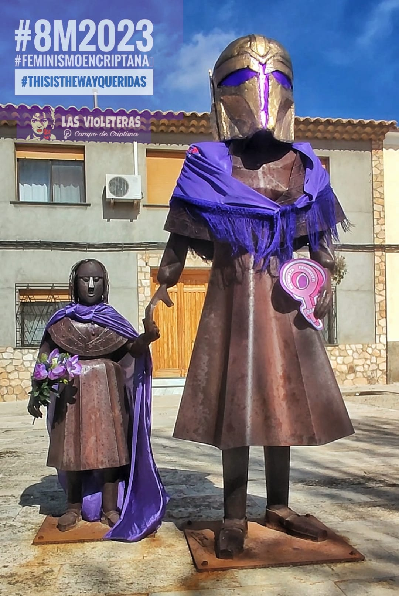

Hoy, 8 de marzo, efeméride feminista, La Asociación “Las Violeteras” volvemos a salir a la calle, como en estos últimos años, para reclamar nuestros derechos y luchar contra la persistente y anquilosada precariedad, las desigualdades, las injusticias y violencias que sufrimos las mujeres, por el mero hecho de serlo, junto a la doble desigualdad que conlleva haber nacido en el medio rural.

Volvemos a alzar la voz de nuestros pueblos azotados por la falta de oportunidades, la sobreexplotación de sus recursos y la devaluación del sector primario. Nosotras vemos como las grandes ciudades absorben el potencial humano de jóvenes como nosotras, obligándonos a migrar, en muchos casos, en busca de oportunidades laborales que nos alejan de nuestro pueblo.

Alzamos nuestras voces por la crisis climática y energética, por la desertificación de nuestro territorio y la sobreexplotación y contaminación de unos recursos acuíferos cada vez más agotados, por nuestra falta de conciencia a la hora de crecer y explotar los recursos sin reparar en las secuelas generacionales. También alertamos de las falsas eco-inversiones a energías “verdes” de grandes multinacionales y de las quimeras que prometen con sus macro instalaciones sin advertencias de esas letras pequeñas. Nosotras decimos: “¡Renovables sí, pero no así!”.

Alzamos nuestras voces como mujeres agricultoras; hijas, abuelas, madres y narradoras de nuestro día a día y nuestro tiempo. Mujeres testigo de los cambios agrícolas y que nos preguntamos: ¿Es esta agricultura sostenible y mantenedora de riqueza a largo plazo para nuestra gente? o ¿Acaso no es el momento de apostar por otras fórmulas?

Tomando el plano turístico como motor económico vemos como se apuesta por modelos irrespetuosos con sus gentes y tendentes a la privatización de los recursos de nuestro entorno, así como las miras de exposición masiva de su patrimonio histórico-artístico sin medir sus efectos menos visibles.

A todas las que desde el principio de los tiempos venimos poniendo el cuerpo y la vida en el centro; desde todos los rincones, urbanos y rurales, desde todos los barrios y todos los pueblos, desde todas las luchas, desde todos los cuerpos, desde todas las existencias y capacidades, y desde todas las generaciones; nosotras, las feministas, seguiremos saliendo al espacio público, a nuestra plaza, para recordar que como municipio tenemos que seguir avanzando en: 

 - Reconocer y valorar el trabajo de cuidados en el sistema público como motor esencial e indispensable de nuestra sociedad.
- Romper con la división sexual del trabajo y con un mercado laboral que ofrece a las mujeres temporalidad, precariedad, incertidumbre o bajos salarios en sus empleos y que impide un acceso equilibrado entre mujeres y hombres.
- Mejorar el reparto de tareas o las herramientas para compatibilizar trabajo de cuidados con el resto de jornadas laborales.
- Reclamamos pensiones iguales para una vejez digna.
- Reclamamos el acceso a una vivienda digna. La precariedad laboral, las subidas de los precios y alquileres nos expulsan de nuestros barrios y nuestros pueblos. Debemos ofrecer a las mujeres más jóvenes la posibilidad de vivir y realizarse como realmente quieran en su contexto, sin necesidad de emigrar a las grandes ciudades. Recordando que ¡Sin mujeres no hay futuro!.
- Por último, debemos considerar las violencias machistas como cuestión que atañe a nuestro municipio a la vez que seguir trabajando por un modelo de convivencia que respete la pluralidad y diversidad afectivo-sexual de la ciudadanía Criptanense. Rechacemos enérgicamente los discursos de odio en cualquiera de sus facetas, rechazando cualquier tipo de violencia que fomente conductas sexistas, capacitistas, clasistas, racistas, xenófobas o que inciten a la violencia de género, homofóbica o transfóbica.

Los avances que estamos consiguiendo para que nuestro consentimiento esté en el centro, para que nuestras decisiones importen, para que nuestro deseo se tenga en cuenta y para que los cuerpos de las mujeres no puedan ser agredidos ni violados, se logran gracias a todas las que gritamos ayer, hoy y siempre: ¡Hermana, yo si te creo!.

Por todo ello, es imprescindible un verdadero cambio cultural, con medidas educativas de protección y de reparación auténtica para todas las mujeres, la infancia y la adolescencia amenazadas y que elimine, de una vez por todas, el retrógrado sesgo patriarcal en la justicia.

También, queremos recordar a todas las refugiadas, migrantes y desplazadas por las guerras y desastres naturales, por las consecuencias del extractivismo, por las asesinadas, arrestadas o exiliadas por reclamar sus derechos, fruto de un patriarcado capitalista, imperialista y racista que ignora las muertes en el mediterráneo o la masacre de la valla de Melilla, por todas aquellas que padecen en tantos conflictos armados invisibilizados. Hoy, ellas huyen hacia las fronteras buscando otro mañana, dejando atrás a su gente, a sus raíces. 

Tampoco olvidemos a aquellas que hoy, aunque quisieran, no pueden acompañarnos: trabajadoras precarias, trabajadoras en servicios mínimos, cuidadoras o las mujeres asesinadas a causa de Violencia de género (15 en lo que llevamos de año).

Para concluir queremos remarcar la importancia de caminar juntas, como hicieron las que estuvieron antes, para la consecución de nuestros derechos y libertades. Debemos seguir tejiendo redes con la convicción de que sólo entendiendo y aprendiendo de nuestras diferencias conseguimos avanzar TODAS.

La responsabilidad de dejar un mundo mejor para las generaciones venideras está en nuestras manos ahora. Sigamos luchando por nuestras libertades y derechos.

_Por un feminismo rural, diverso, interseccional y ecologista. Este es el camino, Queridas.
Porque fuimos, somos y seremos, ¡Ni Un Paso Atrás!_

Gracias.

