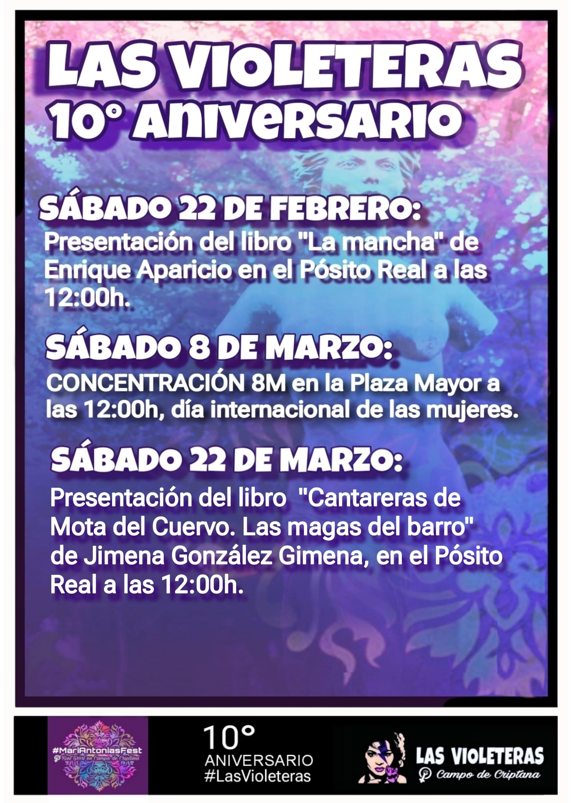
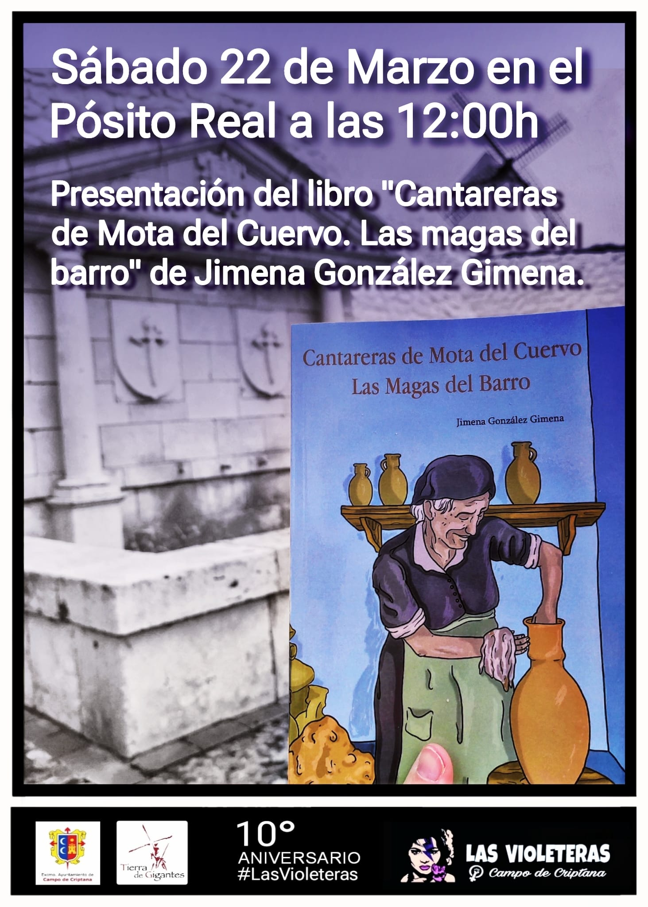

Otro Marzo más, La Asociación feminista Las Violeteras, volvemos a salir a la calle, a llenar nuestra plaza, para reivindicar nuestros derechos y luchar contra la persistente y anquilosada precariedad, las desigualdades, las injusticias y las violencias que sufrimos las mujeres, por el mero hecho de serlo, junto con la desigualdad que conlleva haber nacido en el medio rural.

Porque HOY es un día de REIVINDICACIÓN y LUCHA. HOY y TODOS LOS DÍAS DEL AÑO, y NO de CELEBRACIÓN, como se insiste en remarcar. ¿Celebración? Sí, por los derechos conseguidos, pero sin difuminar el objetivo de esta lucha feminista: conseguir una igualdad real y efectiva.

Volvemos a alzar la voz de nuestros pueblos azotados por la falta de oportunidades, la sobreexplotación de sus recursos y la devaluación del sector primario. Vemos como las grandes ciudades absorben el potencial de jóvenes como nosotras, obligándonos a migrar, en muchos casos, en busca de oportunidades laborales que nos alejan de nuestro pueblo.

En estos tiempos de incertidumbre, es importante saber de dónde venimos para pensar e imaginar caminos que nos lleven a un futuro mejor; caminos hacia una nueva ruralidad llena de feminismo, agroecología, diversidad, y teniendo muy en cuenta las realidades que azotan nuestros medios rurales. No queremos esa ruralidad, que nos intentan imponer, bajo la mirada de la nostalgia, la romantización y ese paternalismo de quienes vienen a decirnos cómo han de hacerse las cosas en nuestros pueblos.

Alzamos nuestras voces por la crisis climática y energética, por la desertificación de nuestro territorio, la sobreexplotación y contaminación de unos recursos acuíferos cada vez más agotados, por nuestra falta de conciencia a la hora de crecer y explotar los recursos sin reparar en las secuelas generacionales. También alertamos de las falsas eco-inversiones a energías “verdes” de grandes multinacionales y de las quimeras que prometen con sus
macro instalaciones, sin advertir de las letras pequeñas. Nosotras decimos: “¡Renovables sí, pero no de esta manera!”

Alzamos nuestras voces como mujeres agricultoras; hijas, abuelas, madres y narradoras de nuestro día a día y nuestro tiempo. Mujeres testigos de los cambios agrícolas y que nos preguntamos: ¿Es esta agricultura sostenible y mantenedora de riqueza a largo plazo para nuestra gente? ¿O acaso no es el momento de apostar por otras fórmulas?

Tomando el plano turístico como motor económico vemos como se apuestan por modelos irrespetuosos con sus gentes y su entorno, tendentes a la privatización de los recursos, así como de la explotación masiva de su patrimonio histórico-artístico sin medir sus efectos menos visibles. Porque todo vale para quienes vienen y se irán mostrando la cara más maquillada y escenografía de ese “pueblecito con encanto”. Esto ocurre cuando se priman
las apariencias y no el rigor histórico y de protección patrimonial como seña de identidad de un lugar.

A todas las que desde el principio de los tiempos venimos poniendo el cuerpo y la vida en el centro, que no nos vengan con paternalismos. No solo nos convertimos, una vez más, en las principales sustentadoras de la vida, sino que seguimos trabajando desde nuestros pueblos y campos para abastecer de materia prima a nuestras comunicadas y GRANDES URBES.

Nosotras, las feministas, seguiremos saliendo al espacio público, a nuestra plaza, para recordar que como municipio tenemos que seguir avanzando en:

- Reconocer y valorar el trabajo de cuidados en el sistema público como motor esencial e indispensable de nuestra sociedad. ¡Sin nosotras el sistema se hunde!
- Romper con la división sexual del trabajo y con un mercado laboral que ofrece a las mujeres temporalidad, precariedad, incertidumbre o bajos salarios en sus empleos y que impide un acceso equilibrado entre mujeres y hombres.
- Visibilizar las asesinadas por Violencia de género en un 2025 que sigue cobrándose sus víctimas mes a mes. En lo que llevamos de año 11 han sido las mujeres asesinadas por sus parejas o exparejas; los cuales son hijos sanos de un sistema que sigue reproduciendo violencia y misoginia hacia las mujeres.
- Mejorar el reparto de tareas o las herramientas para compatibilizar trabajo de cuidados con el resto de jornadas laborales.
- Reclamamos el acceso a una vivienda digna. La precariedad laboral, las subidas de los precios y alquileres nos expulsan de nuestros barrios y nuestros pueblos. Debemos ofrecer a las mujeres más jóvenes la posibilidad de vivir y realizarse como realmente quieran en su contexto, sin necesidad de emigrar a las grandes ciudades. Recordando que ¡SIN MUJERES NO HAY FUTURO!.
- Por una redistribución justa y suficiente de los bienes y recursos junto a la preservación y cuidados necesarios para cubrir las necesidades básicas de todos los seres humanos, dentro de los límites que nos impone el planeta Tierra y las exigencias de la sostenibilidad de todas las formas de vida.
- Por último, debemos considerar las violencias machistas como cuestión que atañe a nuestro municipio a la vez que seguir trabajando por un modelo de convivencia que respete la pluralidad y diversidad afectivo-sexual de la ciudadanía criptanense. Rechazamos enérgicamente los discursos de odio en cualquiera de sus facetas, de cualquier tipo de violencia que fomente conductas sexistas, capacitistas, clasistas, racistas, xenófobas o que inciten a la violencia de género, homofóbica o transfobia.
  
Los logros que hemos conseguido son avances PARA TODAS. Las redes de apoyo que
hemos estado construyendo todas nosotras (la sororidad al grito de “¡HERMANA, YO SI TE CREO!”), se ha materializado en consecuencias reales… porque vecinas ¡SE ACABÓ!

Se acabó la impunidad de los señores que utilizan su influencia, puesto y poder para agredirnos en privado o públicamente. Esta última oleada feminista ha colocado las violencias sexuales en el foco para que nuestro deseo esté en el centro, nuestro consentimiento sea bandera, para que nuestras decisiones importen y para que los cuerpos de las mujeres no sean violentados, agredidos, ni violados.

Tampoco olvidamos a las mujeres más vulnerables, las que caen dentro del círculo prostitucional, de la llamada esclavitud del siglo XXI. Sus cuerpos sufren la peor de las violencias sexuales convirtiéndose en mercancía para proxenetas y puteros que normalizan estas prácticas, porque todos como sociedad seguimos mirando para otro lado o normalizando prácticas poco éticas como los vientres de alquiler.

También, queremos recordar a todas las refugiadas, migrantes y desplazadas por las guerras y el cambio climático, por las consecuencias del extractivismo, por las asesinadas, arrestadas o exiliadas por reclamar sus derechos, fruto de un patriarcado capitalista, imperialista y racista que ignora y olvida las muertes en el mediterráneo o la masacre de la valla de Melilla; por todas aquellas que padecen en tantos conflictos armados y que una vez más, en nuestro país, vuelven a ser explotadas o vejadas como internas o jornaleras bajo la mirada pasiva de nuestra comunidad.

Por ello APELAMOS al deber moral y legal de los gobiernos y de las instituciones de garantizar la vida, los derechos y el bienestar de la ciudadanía global.

Por nuestras hermanas Palestinas, y Congoleñas, Somalíes, Ucranianas, Sudanesas y Afganas; todas ellas, huyen dejando a su gente y sus raíces ante un despotismo que vulnera todo derecho humano.

EXIGIMOS EL FIN DE LA OCUPACIÓN DE PALESTINA.

Tampoco olvidemos a aquellas que hoy, aunque quisieran, no pueden acompañarnos: trabajadoras precarias, trabajadoras en servicios mínimos, cuidadoras o las mujeres asesinadas a causa de Violencia de género.

Por todo ello, es imprescindible un verdadero cambio cultural, con medidas educativas de protección y de reparación auténticas para todas las mujeres, cuya infancia y adolescencia se ven amenazadas, y que elimine, de una vez por todas, el retrógrado sesgo patriarcal en la justicia.

Para concluir queremos remarcar la importancia de caminar juntas, como hicieron las que estuvieron antes, para la consecución de nuestros derechos y libertades.

Dejémonos de zancadillas, de reproches, de intentar aprovecharnos de una lucha con el objeto de conseguir beneficios políticos y comerciales.

TENEMOS y DEBEMOS seguir tejiendo redes con la convicción de que SÓLO entendiendo y aprendiendo de nuestras diferencias conseguiremos avanzar TODAS.

La responsabilidad de dejar un mundo mejor para las generaciones venideras está en nuestras manos ahora. ¡Sigamos luchando por nuestras libertades y derechos!

**Por un feminismo rural, diverso, interseccional y ecologista.**

**¡Este es el camino, María Antonia!**

**Porque fuimos, somos y seremos, ¡Ni Un Paso Atrás!**

Gracias.

