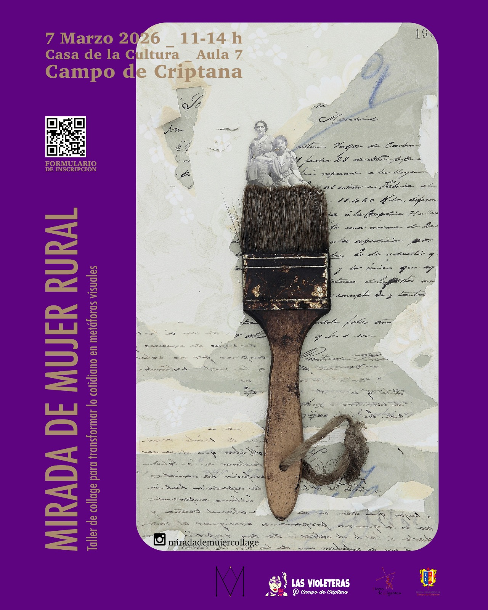
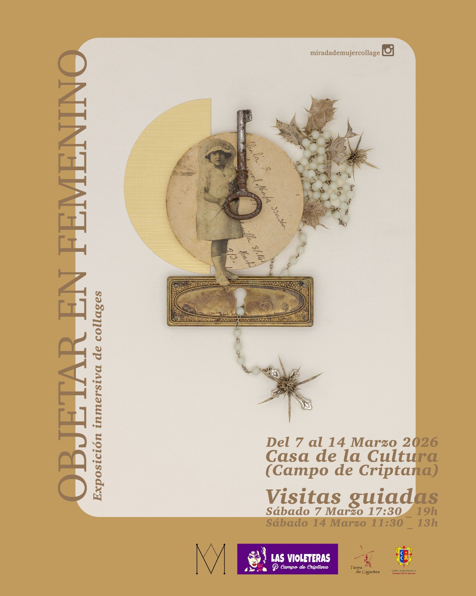

## Manifiesto 8M 2026

Otro marzo más, La Asociación feminista Las Violeteras, volvemos a salir a la calle, a llenar nuestras plazas, para reivindicar nuestros derechos y luchar contra la persistente y anquilosada precariedad, las desigualdades, las injusticias y las violencias que sufrimos las mujeres, por el mero hecho de serlo, junto con la desigualdad que conlleva haber nacido en el medio rural.

Porque **HOY es un día de REIVINDICACIÓN y LUCHA. HOY y TODOS LOS DÍAS DEL AÑO**, y **NO de CELEBRACIÓN**, como se insiste en remarcar.

¿Celebración? Sí, por los derechos conseguidos, pero sin difuminar el objetivo de esta lucha feminista: conseguir una igualdad real y efectiva.

Debemos seguir recordando que la efeméride del **8M** no es un mero día de celebración y que nuestras instituciones y centros de referencia no deberían difuminar el foco de lo que subyace en este día, que aunque incómodo para algunos, sigue siendo necesario.

Por ello, en la plaza de nuestro pueblo, ocupando espacio público en el corazón de nuestro pueblo, como acto simbólico por la igualdad real y la justicia social,

### **VOLVEMOS A ALZAR LA VOZ**

Volvemos a alzar la voz por:

- La falta de oportunidades en nuestros pueblos.
- La sobreexplotación de sus recursos.
- La devaluación del sector primario.

Vemos cómo las grandes ciudades absorben el potencial de jóvenes como nosotras, obligándonos a migrar en busca de oportunidades laborales.

En estos tiempos de incertidumbre, es importante saber de dónde venimos para imaginar caminos hacia un futuro mejor: una nueva ruralidad llena de feminismo, agroecología y diversidad.

No queremos una ruralidad nostálgica ni romantizada, ni el paternalismo de quienes vienen a decirnos cómo deben hacerse las cosas en nuestros pueblos.

### **ALZAMOS NUESTRAS VOCES**

#### 🌍 Por la crisis climática y energética

- Desertificación del territorio.
- Sobreexplotación y contaminación de acuíferos.
- Falsas eco-inversiones de grandes multinacionales.
- Macroinstalaciones energéticas con graves impactos.

**“Sí a las renovables, pero no de esta manera”**

#### 🚜 Como mujeres agricultoras

Hijas, abuelas, madres y narradoras de nuestro tiempo.

Nos preguntamos:

- _¿Es esta agricultura sostenible y mantenedora de riqueza a largo plazo?_
- _¿No es el momento de apostar por otras fórmulas?_

#### 🏘️ Por nuestros barrios y el modelo turístico

Denunciamos:

- Modelos turísticos irrespetuosos.
- Destrucción de arquitectura tradicional.
- Escenografías para turistas que dañan identidad vecinal.
- Expulsión de vecinas y pérdida de comunidad.

Por barrios vivos y reales.

### **REIVINDICACIONES SOCIALES**

Como municipio debemos avanzar en:

- **Reconocer y valorar el trabajo de cuidados** como motor esencial de la sociedad.
- **Romper la división sexual del trabajo** y la precariedad laboral femenina.
- **Mejorar el reparto de tareas** y la conciliación.
- **Garantizar acceso a vivienda digna** para evitar la expulsión de mujeres jóvenes.
- **Redistribución justa de bienes y recursos** dentro de límites ecológicos.
- **Combatir las violencias machistas** y proteger la diversidad afectivo-sexual.
- **Rechazar discursos de odio** y toda forma de discriminación.

### **AVANCES DEL FEMINISMO**

Gracias al movimiento feminista se han logrado leyes pioneras como:

- Ley Integral contra la Violencia de Género.
- Igualdad efectiva entre mujeres y hombres.
- Interrupción voluntaria del embarazo.
- Libertad sexual.
- Representación paritaria.
- Igualdad salarial.
- Reconocimiento del acoso sexual laboral.

**Pero siguen existiendo graves desigualdades:**

- Brecha salarial del 15%.
- Baja tasa de denuncia en agresiones sexuales.
- Aumento de violencia digital.
- Retroceso de derechos.

### **SORORIDAD Y JUSTICIA**

Las redes de apoyo feministas han logrado consecuencias reales.

_¡HERMANA, YO SÍ TE CREO!_

Se acabó la impunidad de hombres poderosos.

El consentimiento, el deseo y la autonomía de las mujeres deben estar en el centro.

### **MUJERES VULNERABLES**

No olvidamos a:

- Mujeres en prostitución y explotación sexual.
- Víctimas de vientres de alquiler.
- Refugiadas y desplazadas por guerras y crisis climática.
- Mujeres explotadas como internas o jornaleras.
- Mujeres asesinadas por violencia de género.

### **SOLIDARIDAD INTERNACIONAL**

Apelamos al deber moral y legal de gobiernos e instituciones de garantizar derechos humanos.

Por nuestras hermanas:

- Irán
- Palestina
- Congo
- Somalia
- Kurdistán
- Ucrania
- Sudán
- Afganistán

**Exigimos:**

- Alto el fuego en Gaza.
- Fin de la ocupación de Palestina.
- Fin de la manipulación política del sufrimiento de las mujeres.

### **CAMBIO CULTURAL NECESARIO**

Es imprescindible:

- Medidas educativas reales.
- Protección y reparación para víctimas.
- Eliminación del sesgo patriarcal en la justicia.

### **UNIDAD FEMINISTA**

Caminemos juntas como hicieron quienes nos precedieron.

- Sin zancadillas.
- Sin reproches.
- Sin invisibilizar luchas.
- Sin instrumentalización política.

Solo entendiendo nuestras diferencias avanzaremos todas.

### ✊ CONCLUSIÓN

La responsabilidad de un mundo mejor está en nuestras manos.

**Por un feminismo rural, diverso, interseccional y ecologista.**

**¡Este es el camino!**  **Porque fuimos, somos y seremos:**

### ***¡NI UN PASO ATRÁS!***

## Actividades para el 8M 

Como en los últimos años Las Violeteras de Campo de Criptana hemos preparado toda una semana de actividades reivindicativas.

En esta ocasión organizamos un TALLER DE COLLAGE y ensamblaje cuyo tema central girará sobre el rol, de sostén social, que ha formado parte de las mujeres del entorno rural – madres, abuelas o de nosotras mismas- para a través de la práctica artística, poner en valor el trabajo de cuidados.

Guiado por Sandra Jiménez (@miradademujercollage) realizaremos la transformación de lo cotidiano en metáforas visuales; objetos que nos llevarán a elaborar collages que hablen de nuestra identidad y la mirada de las mujeres que vengan a participar de este homenaje. 

Está dirigido a todas las MariAntonias, puesto que no es necesario experiencia previa: solo creatividad, ganas de conversar y aprender juntas.

El taller vendrá acompañado de una EXPOSICIÓN INMERSIVA con obra de la artista y de todas las participantes. Una exposición con dos días de visitas guiadas en el horario que veréis en el cartel.

Nosotras no vemos mejor plan para este mes de reivindicación 

_¿Te vienes, MariAntonia?_

> Inscripción al Taller de Collages "Mirada de Mujer Rural" en este enlace: https://docs.google.com/forms/d/1CTY1J8azYvPWHVxCkKk9yNrw7YIhIJaFLdUYWa8cvfo/edit

Exposición inmersiva “Objetar en Femenino”: días y horario de visita guiada determinado en el cartel 2.
