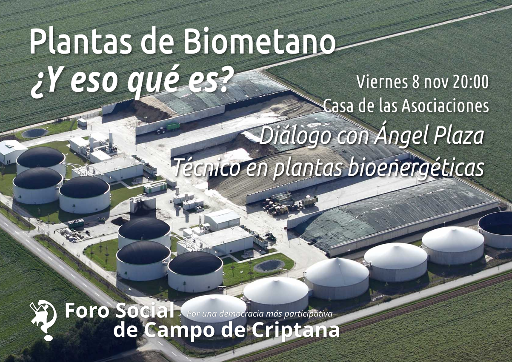
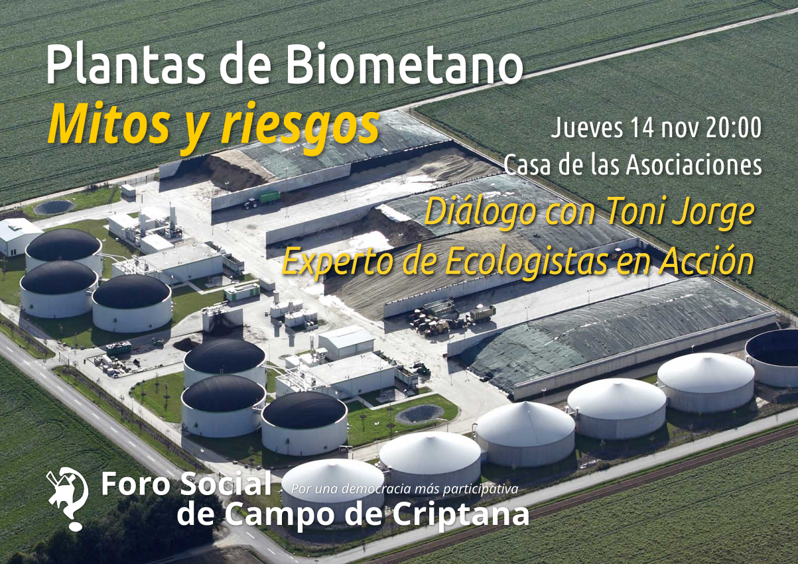

Alarmados por el proyecto de planta de biometano que se pretende instalar en el término municipal de Campo de Criptana, muchos vecinos y vecinas de la localidad nos han pedido más información sobre los riesgos que entrañan este tipo de instalaciones por lo que desde el Foro Social de Campo de Criptana hemos organizado dos charlas informativas sobre las plantas de biometano.

La primera de ellas tendrá lugar el próximo viernes 8 de noviembre a las 20:00 horas en la casa de las asociaciones y contará con la presencia de Ángel Plaza, técnico en plantas bioenergéticas, que nos informará sobre el funcionamiento de una planta de biometano.

La segunda charla se celebrará el jueves 14 de noviembre a las 20:00 horas en el mismo lugar y contará con la participación de Toni Jorge, un experto de Ecologistas en Acción y miembro de la Plataforma Ciudadana contra las Macrogranjas, que nos hablará de los riesgos que entrañan este tipo de instalaciones y a quién benefician.



Desde el Foro Social de Campo de Criptana queremos invitar a toda la población a asistir a estas charlas informativas para que puedan conocer de primera mano los riesgos que entrañan las plantas de biometano y puedan resolver todas sus dudas al respecto. ¡Os esperamos!