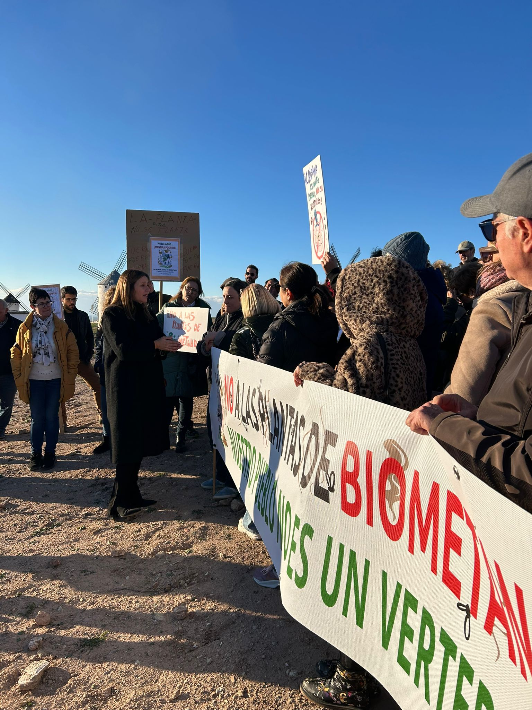

Más de un centenar de vecinos se concentraron ayer en la Sierra de los Molinos de Campo de Criptana a la finalización del III encuentro de la red de agentes de la economía circular de Castilla-La Mancha, donde participó la Directora General de Economía Circular, para decir NO al Plan de Biometanización de la Junta de Comunidades de Castilla-La Mancha.

Campo de Criptana es uno de los pueblos de Castilla-La Mancha agraciado con la "lotería" del Biometano (entiéndase la ironía), porque en este municipio está prevista la construcción de 2 plantas de Biometano que en conjunto pretenden tratar 250.000 toneladas de residuos. El Plan de Biometanización de Castilla-La Mancha que la Consejera de Desarrollo sostenible quiere imponer a toda costa, prevé la implantación de un centenar de estas plantas en un futuro inmediato. 

Nos venden la propuesta como la solución a la gestión de los residuos que hasta ahora no sabían cómo gestionar. Y es que este tipo de plantas, que funcionan mediante la descomposición anaeróbica de los residuos orgánicos, puede ser una buena solución para gestionar los residuos de nuestros pueblos (lodos de las estaciones depuradoras, alperujos, vinazas o excrementos ganaderos) a pequeña escala, es decir, cuando se dimensionan al volumen de residuos de la localidad y se supervisan todas las medidas de seguridad que son necesarias para evitar vertidos contaminantes en el proceso. Pero las plantas que se pretenden poner en nuestros pueblos son plantas a gran escala, dimensionadas para digerir un volumen de residuos mucho mayor de los generados en nuestras localidades y que serán gestionadas por empresas privadas, cuyo único interés, no nos engañemos, no es la protección del medio ambiente, sino hacer negocio. Desde esta mirada empresarial, tiene sentido que se quieran implantar mega plantas en lugar de micro plantas, porque para que el negocio sea rentable, se requiere un volumen de residuos enorme. Y como los residuos locales no serán suficientes para alimentar estas plantas, tendrán que traerlos de lejos, lo que supondrá multitud de camiones cargados de residuos malolientes circulando por nuestro término municipal a diario.

Por otro lado, no se nos escapa que a finales de diciembre termina la moratoria establecida por el gobierno de Paje para los proyectos de macrogranjas en la región, y este plan de biometanización será la coartada perfecta para levantar la moratoria a este tipo de granjas industriales intensivas que tantos problemas ambientales generan. No nos extrañemos de que a partir de enero empiecen a aparecer como setas macrogranjas por todo poda Castilla-La Mancha y especialmente en los términos municipales donde haya ubicadas plantas de biometano. En otros países como Alemania ya ha pasado. Y si metemos en la ecuación las emisiones de gases de efecto invernadero que generan las macrogranjas (especialmente porcinas), desde la importación del pienso de engorde, hasta la exportación fuera de nuestras fronteras de más del 60% de la producción, pasando por la industria de transformación y el transporte de los residuos hasta las plantas de biometano, el resultado es un desastre medioambiental. Todo ello nos hace pensar, y así lo han entendido otros muchos pueblos donde se han constituido plataformas contra las macrogranjas, que el Plan de Biometanización de Castilla-La Mancha es un plan de macrogranjas encubierto, y que, más que el interés del gobierno regional por la economía circular, lo que hay detrás es un interés por favorecer a las grandes empresas del sector agroalimentario y energético, como por ejemplo Incarlopsa. Porque además, se trata de un negocio privado que se va a financiar con ingentes cantidades de dinero público, es decir, con dinero de las vecinas y vecinos que luego vamos a soportar los impactos ambientales de estas plantas, y que, como ha pasado en otros sectores donde ha habido una abundante lluvia de dinero público, se presta a la especulación y a la corrupción.

Por todo ello, desde el Foro Social de Campo de Criptana exigimos a la Consejera de Desarrollo Sostenible que retire el Plan de Biometanización de Castilla-La Mancha y que, si de verdad se quieren tomar en serio la economía circular, empiecen por la reducción de residuos ganaderos, impidiendo este tipo de macrogranjas insostenibles y apostando de verdad por una ganadería tradicional, extensiva y a pequeña escala. Y hacemos un llamamiento a las poblaciones castellanomanchegas a movilizarse, porque, tal y como ha reconocido la propia directora general de economía circular, cuando los pueblos se organizan y se movilizan, este tipo de proyectos no salen adelante.

