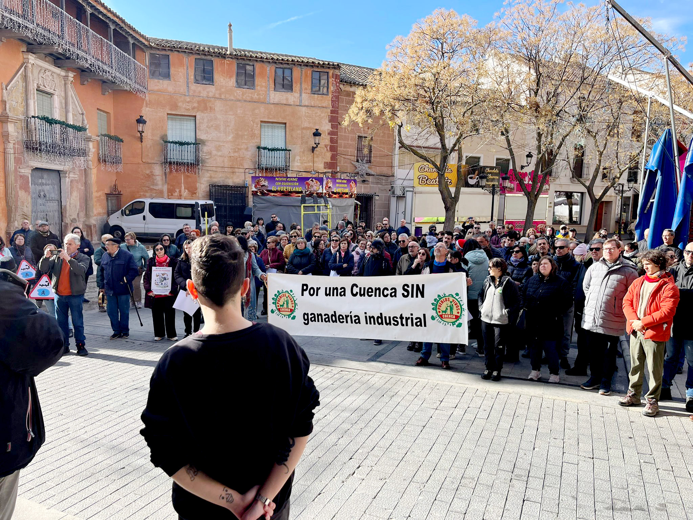

El pasado 4 de enero se realizó la primera concentración contra las plantas de biometano convocada por la recién constituida plataforma STOP BIOMETANO CRIPTANA. La concentración tuvo lugar en la plaza del Campo de Criptana y contó con la presencia de varios centenares de vecinos de la localidad y de otros municipios de la comarca, por lo que puede considerarse todo un éxito, teniendo en cuenta que la plataforma se constituyó hace apenas dos semanas.

Representantes de la plataforma informaron sobre el estado de los dos proyectos de plantas previstos en el término municipal y leyeron el [manifiesto de posicionamiento de la plataforma en contra de las macrogranjas y el plan regional de biometanización](./doc/manifiesto-stop-biomentano-criptana.pdf). Manifestaron también que _“la Plataforma es un movimiento vecinal por la defensa del bienestar y la calidad de vida para las vecinas y vecinos de Campo de Criptana, por nuestro derecho a respirar un aire limpio, a beber sin miedo de nuestras aguas, a disfrutar de nuestro entorno y patrimonio natural, por nuestro derecho a formar parte en la toma de decisiones”_. Se declaró su carácter de organización horizontal, no violento, asambleario y apartidista, que se reúne de manera asamblearia, y cuyo objetivo es evitar la instalación de macroplantas de biometano y macrogranjas en la localidad.

Por su parte, los asistentes portaban varias pancartas y multitud de carteles donde se leían mensajes como _“nuestro pueblo no es un vertedero”_, _"estas plantas no se plantan"_ o _"stop gorrinadas"_. La concentración terminó con varios villancicos con letras de denuncia y con la recogida de firmas contra estos proyectos. 

En la concentración participaron también miembros de la plataforma Stop Macrogranjas, quienes mostraron su apoyo a la plataforma criptanense e informaron de que con el nuevo decreto de purines, se potencia el desarrollo de macrogranjas de cerdos, y que a pueblos como Criptana, donde ahora mismo no hay, pueden venir atraídas por la cercanía de las plantas de biometano. Finalmente alentaron a la población a seguir unida para poder parar estos proyectos especulativos, como ya ha sucedido en otros sitios.

