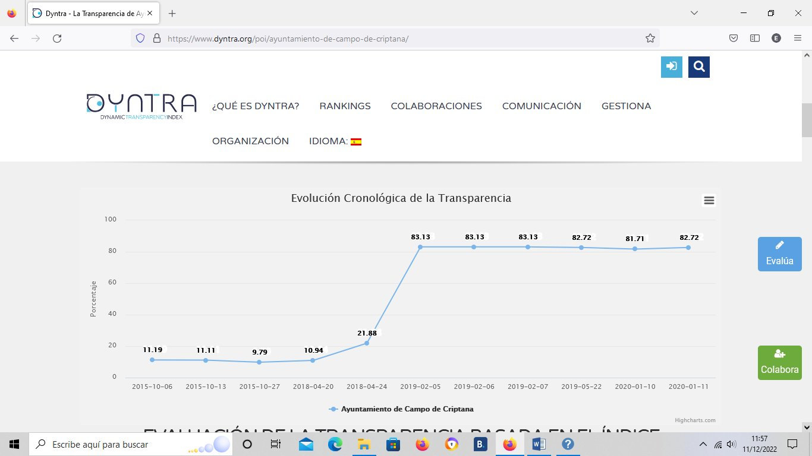
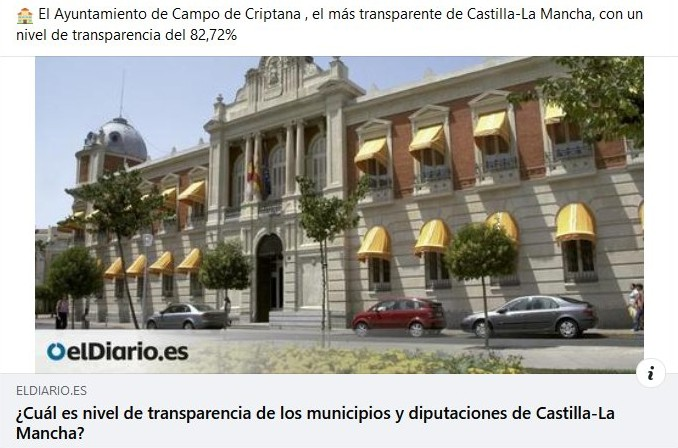
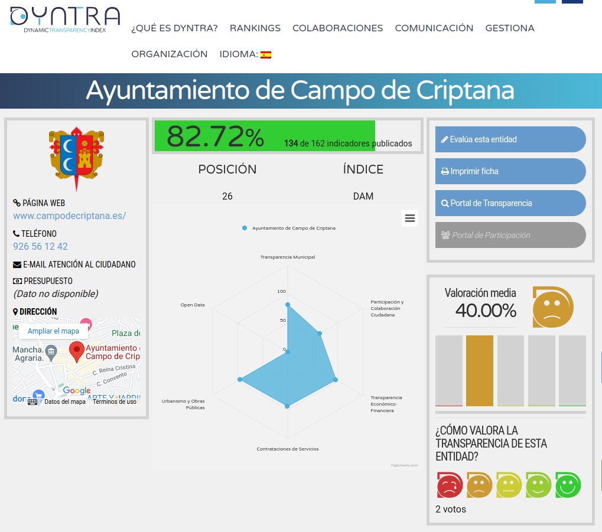

A pocas semanas de finalizar la actual legislatura, sirva esta reseña como breve balance de lo acontecido en materia de transparencia y participación ciudadana en los últimos cuatro años. 

La pasada legislatura, concluida en 2019, supuso un periodo de avances en estas materias que, a nuestro entender, supusieron hechos muy significativos en lo que a carácter democrático se refiere y que se cristalizaron en la creación de una comisión específica para la Transparencia, o la aparición de espacios tan interesantes como el programa “Vida Municipal” dentro de la parrilla de programación de Manchacentro TV, o la inclusión de representantes de todos los grupos políticos dentro de la Junta de Gobierno Local; avances que no tuvieron continuidad con la llegada del actual Equipo de Gobierno.

Además de lo anterior, desde la mencionada Comisión de Transparencia, pilotada por el entonces concejal de UPyD, D. Agustín Olivares, se implementaron dos herramientas que, a nuestro parecer, supusieron un importante legado para nuestro pueblo: la creación del Portal de Transparencia municipal y la aprobación de un Reglamento de Participación Ciudadana.
En lo referente al Portal de Transparencia, tras pocos avances en los primeros años, fue para finales de 2.018 cuando se hace cargo de la puesta a punto y el mantenimiento de esta herramienta, DYNTRA; si miramos en su página web, una organización que ofrece una “plataforma colaborativa que trabaja en la medición y gestión del gobierno abierto en las organizaciones y para la Sociedad Civil”. Echando un vistazo a esta imagen extraída de su la misma, podemos comprobar el enorme impulso que provocó esta circunstancia en los meses inmediatamente posteriores a la fecha indicada.

Tanto es así que al finalizar la legislatura anterior en mayo de 2019, el índice de transparencia de nuestro consistorio se situaba en un 82,72 %, porcentaje que colocaba a nuestro ayuntamiento entre los destacados, tal y como se hacía eco algún medio de comunicación según esta noticia allá por el mes de febrero de 2020.

                    

Tras la última verificación realizada por Dyntra, en fecha 11 de enero de 2020, nuestro portal cumplía 134 de los 162 indicadores. Si echamos un vistazo a la su web en el momento de escribir estas líneas podemos comprobar que la situación es idéntica a la que había en el momento en que comenzó su andadura.

A la vista de esta imagen, la primera conclusión que podríamos extraer es que no se ha avanzado nada en la materia durante estos cuatro años, sin embargo, esta primera impresión no concuerda con el estado actual del Portal, donde podemos comprobar que un número importante de estos indicadores antes citados ya se están publicando. Esta anomalía se explica viendo la fecha de la última verificación realizada por Dyntra, la cual no ha variado. El motivo suponemos que debe ser el cambio en la empresa encargada de llevar la actualización y mantenimiento de esta herramienta que dejó de ser Dyntra y pasó a manos de Dynamic Opengov Technologies S.L., tal y como queda recogido en acta de la Junta de Gobierno de fecha 3 de febrero de 2021, y que sigue prestando sus servicios en la actualidad.

Así pues, a día de hoy, carecemos de los datos para poder valorar la situación real de nuestro portal, ni establecer comparaciones con otros ayuntamientos; tampoco es posible la comparación de la situación actual con la del inicio legislatura para poder ver la evolución llevada a cabo. Desde nuestro punto de vista, sería muy recomendable que se nos facilitara a la ciudadanía esta información de cara al final de la legislatura para poder valorar la gestión del actual Equipo de Gobierno. De entrada, nos parece reseñable que, en el momento de escribir estas líneas, no se encuentre “subido” el proyecto de Presupuesto para 2.023 que se encuentra en periodo de exposición pública tras su aprobación en la última sesión celebrada por el Pleno. Entendemos que sería muy favorable para este Equipo de Gobierno que dejara el porcentaje de información publicada, como mínimo, por encima del que se encontró al inicio.  

El otro legado que dejó la extinta Comisión de Transparencia fue la aprobación, en los estertores de la legislatura, de un Reglamento de Participación Ciudadana (en adelante R.P.C.); este documento tardó toda una legislatura en elaborarse y fue fruto del consenso, en todos los puntos de su contenido, de cada una de las cuatro fuerzas políticas de muy diferente signo que componían el Pleno en ese momento. Lamentamos que un documento así haya permanecido “metido en un cajón” durante estos cuatro años por parte del Equipo de Gobierno sin que se haya hecho prácticamente mención alguna al mismo por parte de ninguno de los tres grupos que han conformado la Oposición.

Puntos importantes de su contenido como la creación de Mesas sectoriales se han quedado sin aplicación y sin que se haya realizado seguimiento alguno de su implementación tal y como se recoge en su articulado. De igual forma se ha eliminado el turno de palabra que se otorgaba al público presente en los Plenos a la finalización de los mismos, desconocemos los motivos. Otros aspectos importantes que recoge, como los presupuestos participativos, si se han puesto en marcha durante la legislatura. Esta herramienta consideramos que puede ser muy interesante para la participación de la gente siempre que se le dé la suficiente cobertura por parte del Ayuntamiento. En los dos años que se ha puesto en marcha se la ha asignado un presupuesto de 15.000 euros, circunscribiéndose exclusivamente al apartado de inversiones. Para nuestra sorpresa, en el presupuesto para el próximo año 2023 esta partida ha sido eliminada, parece ser que por motivos de necesidad presupuestaria; creemos que un importe de 15.000 euros sobre un montante total de más de 12.000.000 millones no supone algo tan significativo como para necesitar eliminarla. Además, si el R.P.C. es un documento aprobado en Pleno y que se encuentra en vigor, entendemos que su contenido, entre el que se incluye lo anterior, debe ser de obligado cumplimiento más allá de la voluntad política del actual Equipo de Gobierno así como del que salga elegido de las urnas dentro de unas semanas.

Otro hecho muy destacable que nos dejó la legislatura pasada, impulsado esta vez por el anterior Alcalde, D. Antonio Lucas-Torres, fue la celebración de un debate previo a las elecciones entre los candidatos de las diferentes fuerzas políticas que concurrían a las mismas; en lo que supuso algo pionero en nuestro pueblo y que esperamos que se repita en estas semanas y en las sucesivas citas electorales. Desde el Foro Social consideramos que este tipo de actos son muy convenientes para el interés de nuestros vecinos y por eso, al igual que en citas anteriores, hemos organizado un debate similar que estaba programado para el viernes día 12 de mayo, con el objetivo de aportar un valor añadido al posible debate organizado por el ayuntamiento, ya que, a diferencia de este, en el nuestro se ofrecía la posibilidad a la ciudadanía de poder participar e interpelar directamente con los candidatos. Tras hacer llegar las invitaciones a los candidatos de las tres formaciones que concurren a las elecciones, **PP y VOX han rechazado participar en el mismo**, por lo que hemos tomado la decisión de suspenderlo pues nos parecía poco enriquecedor hacer el acto con un solo candidato, ya que esto anulaba la posibilidad de debate alguno ni contraste de pareceres.

Queremos agradecer al actual alcalde y candidato del PSOE, D. Santiago Lázaro, su predisposición a participar en este debate, así como en todos los organizados durante esta legislatura por nuestra asociación, a los que ha asistido incluso por iniciativa propia para rendir cuentas a la ciudadanía tras la aprobación de cada presupuesto algo que, si bien no debería ser motivo de agradecimiento por ser algo que entendemos consustancial al ejercicio de sus funciones, y hasta obligado, ya que también está recogido en el articulado del R.P.C., ni se había hecho en nuestro pueblo por los anteriores, ni es la tónica general en los municipios de nuestro alrededor, en lo que sin duda supone un ejercicio de transparencia y acercamiento de las instituciones al pueblo.

