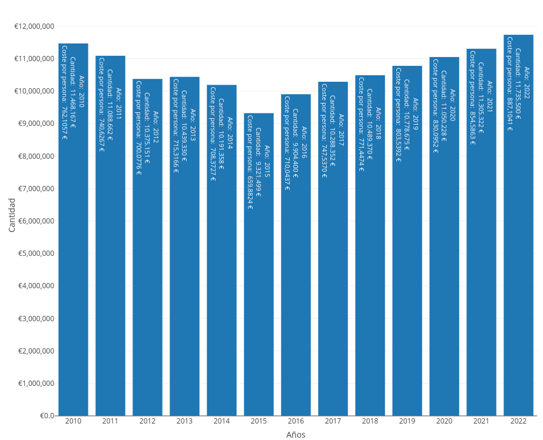
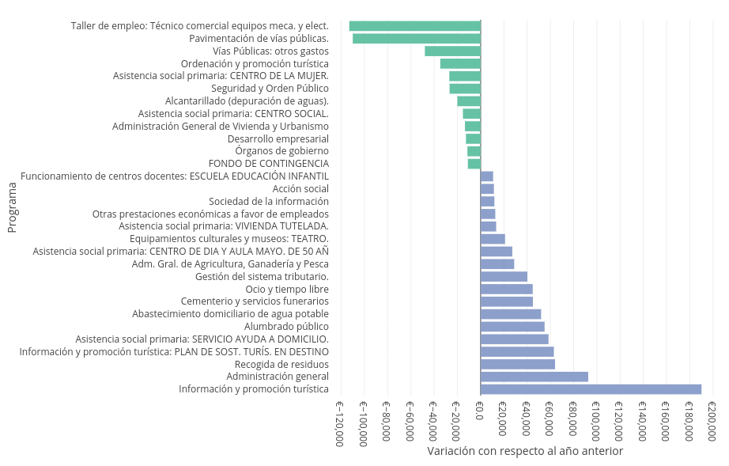
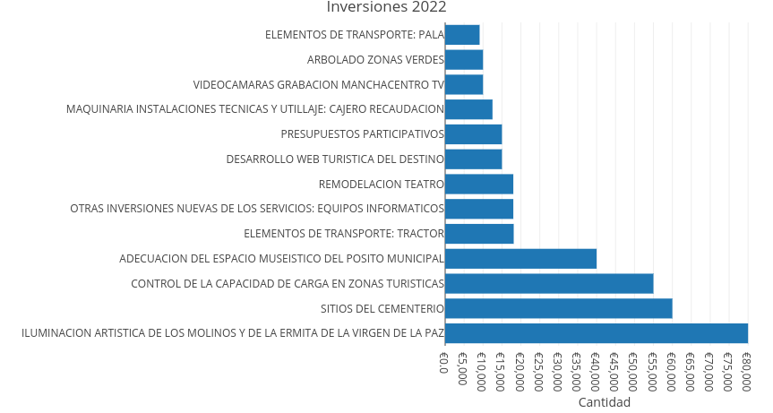

Como en años anteriores el Foro Social de Campo de Criptana ha organizado un acto el próximo **viernes de 18 de marzo a las 20:00 en la casa de las asociaciones** para presentar los presupuestos municipales del presente ejercicio. Una vez más nuestro alcalde, Santiago Lázaro, ha aceptado nuestra invitación y participará en el mismo explicando lo más significativo de estos presupuestos y respondiendo a las preguntas de las personas asistentes.

Desde el Foro Social seguimos trabajando por hacer los presupuestos municipales accesibles a toda la población, ya que no se puede decidir sobre algo que se desconoce, y los presupuestos son el instrumento más importante para desarrollar las políticas públicas. Por ello desde hace años venimos presentando los presupuesto de manera visual en la [web de los presupuestos municipales](https://forosocialcriptana.com/presupuestos), donde no solo se puede entender el reparto del presupuesto, tanto de ingresos como de gastos, sino también su evolución con respecto a años anteriores.



## Análisis del presupuesto municipal 2022

El volumen total del presupuesto para el ejercicio 2022 es de 11.735.500 €, lo que supone un 3.8% más que el ejercicio anterior y confirma la tendencia creciente del presupuesto desde 2015. Esto supone 887 € por persona censada en el municipio.

### Gastos

En el reparto del presupuesto por programas (¿para qué se gasta?) los programas con mayor volumen son la administración general (7.61%), que aumenta casi un 11% con respecto al ejercicio anterior, seguridad y orden público (7.06%), abastecimiento de agua potable (6.76%), instalaciones deportivas (5.38%) y recogida de residuos (5.16%).

Merece la pena mencionar que el abastecimiento de agua potable, actualmente privatizado y en manos de la empresa Aquona, ha vuelto a subir casi un 7% con respecto al ejercicio anterior lo que supone uno de los mayores costes per cápita de la provincia. La recogida y tratamiento de residuos, que está mancomunada a través de la empresa pública Consermancha, también ha experimentado una fuerte subida del 11% con respecto al año pasado.

Otras variaciones significativas con respecto al ejercicio anterior, como apreciarse en el siguiente gráfico, ha sido la promoción turística, que ha aumentado debido a un programa financiado por la junta de comunidades, el servicio de ayuda a domicilio que ha aumentado un 14.73%, los gastos en el cementerio que han aumentado un 38% y el gasto en ocio que ha aumentado un 51%. Por otro lado, desaparece el gasto en el taller de empleo y en la pavimentación de vías públicas, el gasto en el centro de la mujer disminuye un 13.25%, el gasto en la depuración de aguas disminuye un 5.13%, el gasto en el centro social disminuye un 4.48% y finalmente mencionar también que el gasto en los órganos de gobierno disminuye también un 4.64%.

En lo que se refiere a la clasificación económica (¿en qué se gasta?), la mayor parte del gasto del gasto se va, como en otros ejercicios, al personal (48.1%), seguido de cerca por los gastos en bienes corrientes y servicios (44.3%) y a mucha más distancia las inversiones reales (3.49%) que se muestran en el siguiente apartado, las transferencias corrientes, que son las subvenciones a asociaciones sin ánimo de lucro (3.28%) y finalmente la amortización de la deuda (0.47%). Sobre esto último comentar que nuestro municipio es uno de los municipios menos endeudados de la provincia, con una deuda de 1.630.878€ al comienzo del ejercicio, lo que supone un 13.9% del presupuesto total.

### Inversiones

En cuanto a las inversiones reales, el volumen del presupuesto es de 360.700€ y disminuye un 11.15% con respecto a 2021. La mayor inversión prevista para este año es en turismo (iluminación artística de los molinos, adecuación del espacio museístico del pósito y control de la capacidad de carga en zonas turísticas), tal y como se puede apreciar en la siguiente gráfica.

Queremos mencionar también que al igual que el año pasado, el ayuntamiento ha reservado una partida de 15.000€ para los presupuestos participativos que irá destinada a las inversiones que propongan y decidan las vecinas y vecinos de nuestro municipio. Aunque es una partida muy pequeña, nos alegramos de que el actual equipo de gobierno apueste por esta iniciativa y esperamos que vaya toman más protagonismo en futuros años. 

### Ingresos

En la parte de los ingresos, la mayor parte de los ingresos provienen de transferencias de las administraciones central y autonómica (35.5%), de impuestos directos, sobre todo el IBI, (34.5%) y de las tasas públicas (25.5%). Las variaciones son menos importantes que en la parte de los gastos. El mayor aumento se produce en las transferencias del Estado y de la Comunidad Autónoma (6.71%), el aumento de los precios de los museos y exposiciones (34.62%) y el impuesto sobre actividades económicas (31.58%). Y el mayor descenso se produce en el impuesto sobre el incremento del valor de los terrenos de naturaleza urbana (-53.85%) y las tasas de los servicios deportivos (-30.30%).

Para finalizar el análisis de los ingresos cabe mencionar que es el primer año en el que los ingresos por impuestos directos, que tradicionalmente habían sido la principal fuente de financiación de nuestro ayuntamiento, se quedan por debajo de las transferencias que recibimos de otras administraciones. 

Para profundizar más en el detalle de estos presupuestos recomendamos visitar la [web de los presupuestos municipales](https://forosocialcriptana.com/presupuestos) donde se puede acceder a información mucho más desagregada de todos los ejercicios desde 2010. Agradecemos también cualquier sugerencia para mejorar esta web.
