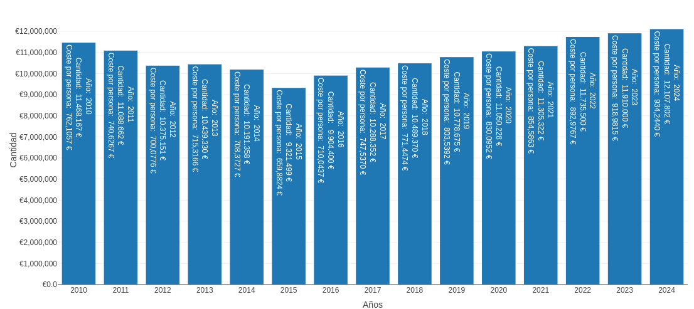
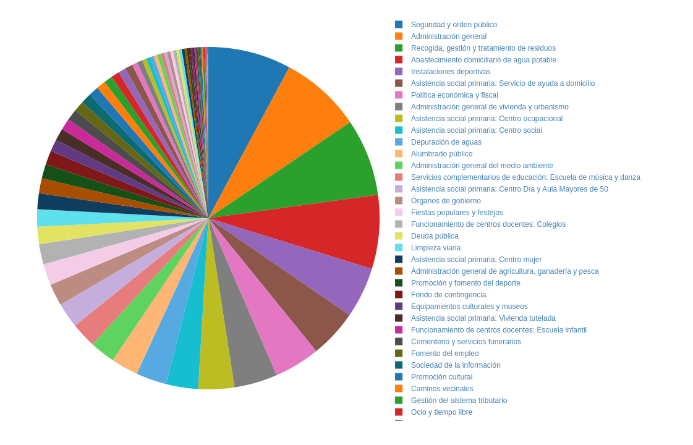
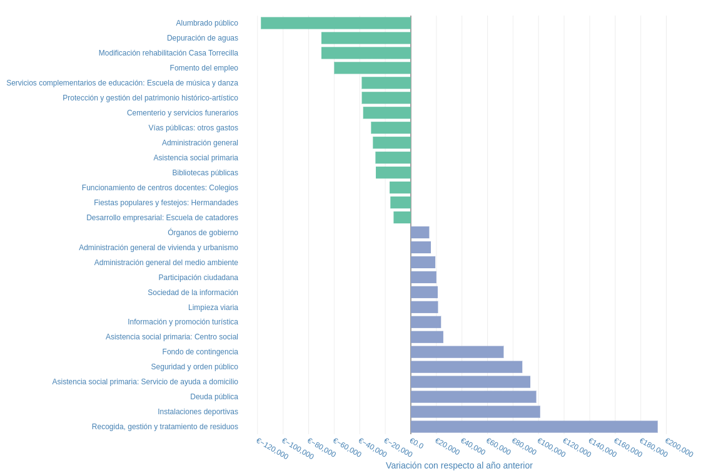
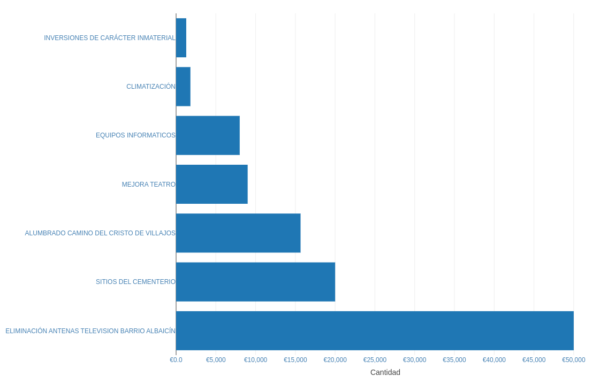
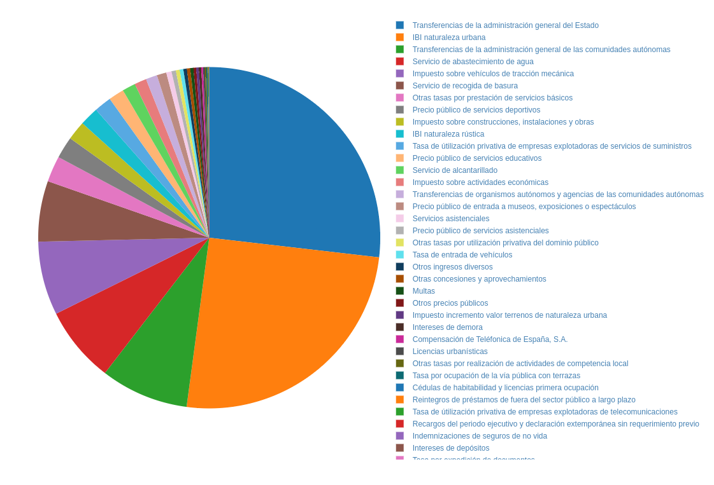
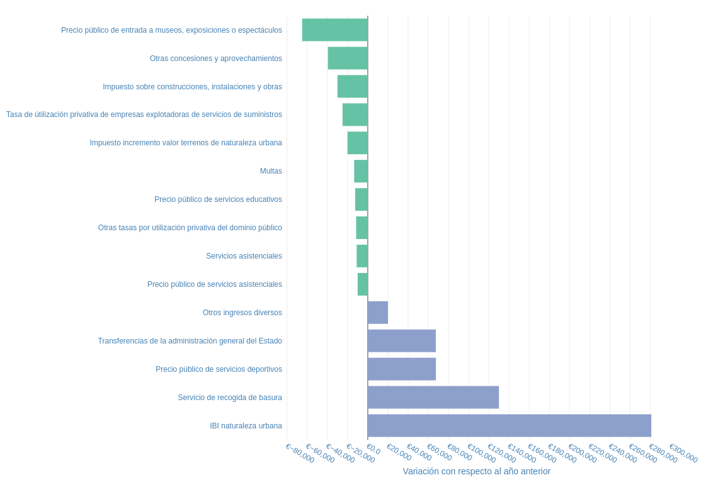

El pasado mes de febrero, con más retraso de lo debido, se aprobaban los presupuestos municipales del Ayuntamiento de Campo de Criptana, y como todos los años el Foro Social de Campo de Criptana ha organizado un acto el próximo **viernes de 10 de mayo a las 20:00 en la casa de las asociaciones** para explicar lo más importante de estos presupuestos. Nuestro alcalde, Santiago Lázaro, ha aceptado otro año más nuestra invitación y participará en el mismo explicando lo más significativo de estos presupuestos y respondiendo a las preguntas de las personas asistentes.

Los detalles de estos presupuestos se pueden encontrar en nuestra [web de los presupuestos municipales](https://forosocialcriptana.com/presupuestos), donde aparecen desglosados los datos de las principales partidas presupuestarias tanto de gastos como de ingresos, con gráficos interactivos que facilitan su comprensión.

## Análisis del presupuesto municipal 2024

El volumen total del presupuesto para el ejercicio 2022 es de 12.107.802 €, y aunque es el mayor presupuesto de la historia de Campo de Criptana, solo supone un 1.4% más que el ejercicio anterior, muy por debajo de la inflación que está sufriendo la economía en los últimos años. Esto supone 921 € por persona censada en el municipio.

### Gastos

En el reparto del presupuesto por programas (¿para qué se gasta?) este ejercicio la mayor partida pasa a ser la seguridad y orden público (7,84%), que adelanta a la administración general (7,69%), seguida de la recogida, gestión y tratamiento de residuos (7.29%) y abastecimiento de agua potable (6.97%).

Entre las partidas con mayor variación con respecto al ejercicio anterior, cabe destacar la recogida y tratamiento de residuos, que está mancomunada a través de la empresa pública Consermancha, que ha experimentado la subida más fuerte con un 28,04% más que el ejercicio anterior, y acumula una preocupante subida del 66% con respecto a 2020.

Otras variaciones significativas con respecto al ejercicio anterior, como apreciarse en el siguiente gráfico, ha sido el gasto en instalaciones deportivas que aumenta un 21,5$, el servicio de ayuda a domicilio que aumenta un 20,33%, la seguridad y orden público, que aumenta un 10,12%, y fondo de contingencia que casi se duplica, con un aumento del 82,6%. Mención especial merece el pago de la deuda pública, que aunque sigue siendo contenido comparado con otros municipios, ha aumentado un 58.4%, confirmando la tendencia creciente de servicio a la deuda de los últimos 4 años.

En el otro extremo tenemos una reducción del 27.48% del gasto en alumbrado público, fruto, sin duda, de la inversión realizada en los últimos años en la renovación de las luminarias de la localidad, por otras más eficientes. También se pretende gastar un 16.7% menos en la depuración de las aguas residuales, el presupuesto destinado a fomento del empleo también se reducirá un tercio.

En lo que se refiere a la clasificación económica (¿en qué se gasta?), la mayor parte del gasto se va, como en otros ejercicios, al personal (52.1%), siendo la primera vez en la historia que este capítulo supone más de la mitad del presupuesto, seguido por los gastos en bienes corrientes y servicios (42.5%). 

### Inversiones

En cuanto a las inversiones reales, el volumen del presupuesto es de 105.727€, siendo menos de la mitad de las del ejercicio 2023, siendo este, uno de los ejercicios con menor inversión de la historia de Campo de Criptana. La mayor inversión prevista para este año es la eliminación de las antenas del barrio del Albaicín, seguida de la construcción de sitios en el cementerio y el alumbrado del camino de cristo.

Con mucha tristeza y pesar, debemos mencionar también que el ayuntamiento ha eliminado de los presupuestos la pequeña partida de 15.000€ que permitió la puesta en marcha de los presupuestos participativos en Campo de Criptana. Una herramienta que permitía a la ciudadanía decidir en qué se invertía una pequeña parte del presupuesto municipal, y que fomentaba la participación y la transparencia en la gestión de los recursos públicos.

### Ingresos

En lo que respecta a los ingresos, este año el presupuesto es 12.187.613, ligeramente superior al de gastos, algo que no es habitual, ya que normalmente el presupuesto de ingresos se equipara al de gastos. Como en anteriores ediciones la mayor parte de los ingresos provienen de tres fuentes: Transferencias de las administraciones central y autonómica (36,2%), de impuestos directos, sobre todo el IBI, (35,4%) y de las tasas públicas (26,2%). Las variaciones son menos importantes que en la parte de los gastos. 

La mayor variación con respecto al año anterior se produce en el IBI que se incrementa más de un 10%, seguido del servicio de recogida de basuras, que aumenta un 22,8%, y los precios públicos de los servicios deportivos, que aumentan un 36,6%. En el otro extremo, la mayor reducción se produce en los precios de entradas a museos y espectáculos, que se reduce un 37,1%, otras concesiones y aprovechamientos, que se reduce a la mitad, y el impuesto sobre construcciones y obras que se reduce un 12%.

Para profundizar más en el detalle de estos presupuestos recomendamos visitar la [web de los presupuestos municipales](https://forosocialcriptana.com/presupuestos) donde se puede acceder a información mucho más desagregada de todos los ejercicios desde 2010. Agradecemos también cualquier sugerencia para mejorar esta web.
