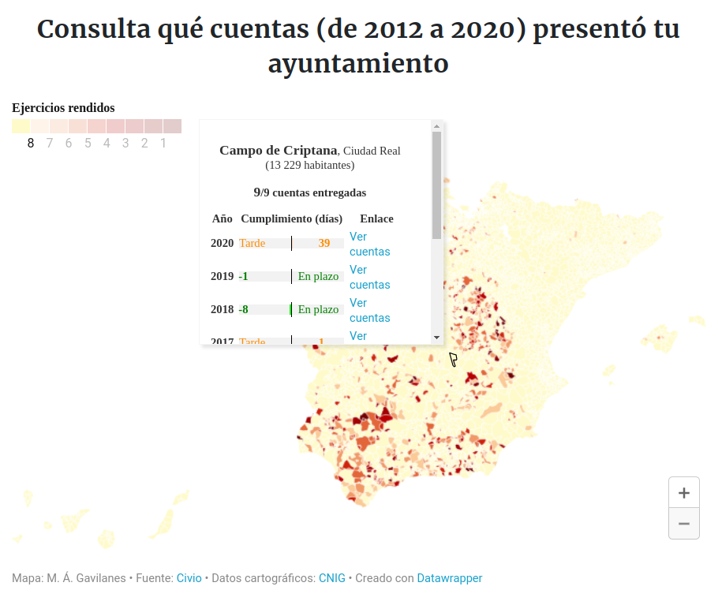

<!-- LTeX: language=es-ES -->

Los ayuntamientos están obligados por la Ley Reguladora de las Haciendas Locales a presentar la liquidación de los presupuestos de cada ejercicio así como la cuenta general ante el [Tribunal de Cuentas](https://www.tcu.es/tribunal-de-cuentas/es/)  para su fiscalización. Sin embargo, no todos los ayuntamientos presentan regularmente sus cuentas ni lo hacen en los plazos que marca la ley. Según el portal de [Rendición de Cuentas](https://www.rendiciondecuentas.es/es/), solo el 70.4% de los ayuntamientos presentaron la liquidación del presupuesto en plazo el ejercicio 2020 y 59.52% presentaron la Cuenta General en plazo. Están quienes cumplen los plazos, quienes se retrasan unas semanas y quienes tardan años en presentar sus cuentas.

La fundación CIVIO ha realizado un [estudio de rendición de cuentas](https://civio.es/2022/06/17/567-ayuntamientos-no-rindieron-sus-cuentas-de-los-ejercicios-2018-2019-y-2020/?utm_source=Lista+General+de+Civio&utm_campaign=7fe62e1a45-Rendici%C3%B3n+de+cuentas+ayuntamientos+2022&utm_medium=email&utm_term=0_9d5b4c8cda-7fe62e1a45-127700986&mc_cid=7fe62e1a45) en el que han extraído los datos de 7.878 municipios del Estado español y ha elaborado un mapa interactivo donde se puede observar qué ayuntamientos cumplen la ley y cuáles no. 

En este mapa se puede apreciar que nuestro ayuntamiento presentó tarde las cuentas del ejercicio 2020. Aunque nuestro ayuntamiento no es, ni mucho menos, de los peores, ya que hay ayuntamientos que incluso tardan años en presentar sus cuentas. Por comunidades autónomas, Castilla-La Mancha, Andalucía y Castilla y León aglutinan la mayoría de estos consistorios.

_¿Qué penalización tiene un ayuntamiento que incumple esta ley?_ Pues la verdad es que poca, porque las multas para estos infractores se fijaron en 1988 entre 10.000 y 150.000 pesetas (entre 60 y 900 euros) y no se han actualizado desde entonces. Con estas sanciones no es de extrañar que muchos ayuntamientos hagan dejación de esta función. Sería mucho más efectivo suspender a estos consistorios las transferencias de dinero público de los impuestos que recauda el Estado, tal y como propuso hace poco la presidenta del Tribunal de Cuentas.

En el caso de nuestro ayuntamiento, las cuentas de los últimos ejercicios están disponibles en el [Portal de Transparencia](https://transparencia.campodecriptana.es/), en el apartado de [Cuentas Municipales, ingresos y gastos](https://transparencia.campodecriptana.es/transparencia-economica/cuentas-anuales-del-ayuntamiento/) de la sección de Transparencia económica.

Animamos a las personas vecinas de Campo de Criptana que tengan tiempo a echarle un vistazo para ver en qué gasta realmente nuestro ayuntamiento el dinero de todas, aunque, dado que son documentos técnicos difíciles de entender para no expertos, sería mucho más efectivo que el ayuntamiento organizase una sesión pública para explicar el cierre de las cuentas ante la ciudadanía como viene haciendo desde hace años con la presentación de los presupuestos municipales.

