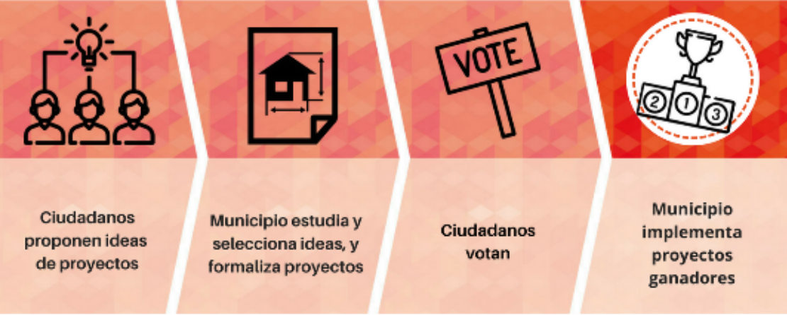

El pasado 9 de agosto se hacía público el [bando municipal de los presupuestos participativos](https://www.campodecriptana.es/images/Anuncios/2021/2021_08_09_BAND_PRESUPUESTOS_PARTICIPATIVOS.pdf) por el que se oficialmente se ponen en marcha los primeros presupuestos participativos de Campo de Criptana.

## ¿Qué son los presupuestos participativos?
Los Presupuestos Participativos son una herramienta de participación directa y activa de la ciudadanía en la gestión de la ciudad, mediante la que la ciudadanía decide el destino de una parte de los presupuestos municipales con el objetivo de todas las personas puedan aportar en la construcción y mejora del municipio.
Los presupuestos participativos ayudan a empoderar a la población local y a dotar de mayor transparencia y eficacia la gestión de los recursos públicos, reforzando el diálogo entre ciudadanía y Administración Pública.

## Objetivos de los presupuestos participativos
·	Impulsar la participación poniendo en el centro los proyectos de la ciudadanía.
·	Fomentar el tejido asociativo y la colaboración ciudadana.
·	Promover el acuerdo y el diálogo directo entre actores locales.
·	Empoderar a la ciudadanía.

## Cuantía de los presupuestos participativos
Para esta primera edición de los presupuestos participativos el ayuntamiento ha dotado una partida presupuestaria de **15.000€**.

## Fases de los presupuestos participativos

Existen muchos modelos de presupuestos participativos pero normalmente suelen contener las siguientes fases:

1.	Dotación presupuestaria.
2.	Presentación del proceso y formación (a técnicos municipales, asociaciones y ciudadanía)
3.	Presentación de propuestas ciudadanas
4.	Agrupación y selección de propuestas
5.	Validación de las propuestas (viabilidad)
6.	Debate y promoción de propuestas
7.	Votación de propuestas
8.	Ejecución de las propuestas
9.	Seguimiento y evaluación

Sin embargo, dada la demora de su puesta en marcha (normalmente se ponen en marcha en enero de cada ejercicio), para este ejercicio el ayuntamiento ha optado por un modelo simplificado que agilice la presentación y votación de las propuestas ciudadanas antes de que acabe el año. Este modelo simplificado incluye las siguientes fases:

1. Presentación de propuestas ciudadanas
2. Validación y agrupación de propuestas por parte de los técnicos municipales
3. Votación de propuestas
4. Ejecución de propuestas

La primera fase, de presentación de propuestas ciudadanas, ya está en marcha desde el 10 de agosto y cualquier vecina/o de Campo de Criptana puede presentar propuestas hasta el 31 de agosto. En el bando se indica que las propuestas tienen que ser referidas a competencias del ámbito municipal pero no se especifica si tienen que ser necesariamente infraestructuras o si también pueden referirse a otros tipos de gastos como por ejemplo servicios. Tampoco se especifica la edad mínima para presentar propuestas ni si el o la proponente tienen que estar censados en el municipio.

Las propuestas ciudadanas pueden presentarse rellenando el siguiente [formulario](https://www.campodecriptana.es/images/Anuncios/2021/2021_08_09_BAND_PRESUPUESTOS_PARTICIPATIVOS.pdf) y presentándolas en la [sede electrónica del ayuntamiento](https://sedeelectronica.campodecriptana.es/sede/castellano/emiservicio/41E6BF9D755E4825AF8E6B49E85B5079.asp) o bien en físicamente en papel en las dependencias del propio ayuntamiento.

Desde el Foro Social nos congratulamos de que el actual equipo de gobierno se sume a la iniciativa de los presupuestos participativos al igual que otros muchos municipios que ya lo vienen haciendo desde hace años, pues los presupuestos participativos han sido una de nuestras principales demandas desde que que nos constituimos. Sin embargo, lamentamos que la puesta en marcha haya sido de esta manera precipitada, sin explicar a la población y al tejido asociativo local en qué consisten los presupuestos participativos, sin formar a los técnicos municipales que vayan a participar en este proceso y eliminando la fase más importante de debate de las propuestas presentadas por parte de la ciudadanía antes de su votación. Esperamos que el actual consistorio se tome en serio esta iniciativa que marca el camino hacia una democracia más participativa y en los próximos años se aborde con menos prisas y más recursos.

